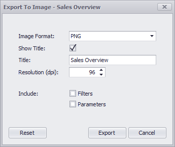
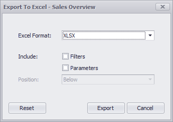

# Printing and Exporting
The Dashboard Viewer provides the capability to print or export an entire dashboard and individual items.
* [Printing and Exporting Dashboards](#printing-dashboards)
* [Printing and Exporting Dashboard Items](#printing-dashboard-items)

## <a name="printing-dashboards"/>Printing and Exporting Dashboards
To print or export the entire dashboard, click the  button in the [dashboard title](data-presentation/dashboard-layout.md) area and choose the required action.

### Print Preview...

Allows you to customize the document before printing/exporting. For instance, the following settings can be changed: the orientation and size of the printed page, page margins, etc.

### Export to PDF

Invokes a corresponding dialog that allows you to export a dashboard to a PDF file with specific options. The following options are available:

* **Page Layout** - Specifies the page orientation used to export a dashboard. You can select between _Portrait_, _Landscape_, and _Auto_. Note that in the _Auto_ mode, page orientation is selected automatically depending on the horizontal and vertical sizes of a dashboard.
* **Size** - Specifies the standard paper size (for instance, _Letter_ or _A4_).
* **Show Title** - Specifies whether or not to apply the dashboard title to the exported document title.
* **Title** - Specifies the title of the exported document.
* **Scale Mode** - Specifies the mode for scaling when exporting a dashboard.
	
	> [!NOTE]
	> Note that this option is in effect when **Page Layout** is set to a value different from _Auto_.
* **Scale Factor** - Specifies the scale factor (in fractions of 1) by which a dashboard is scaled.
	
	> [!NOTE]
	> This option is in effect if **Scale Mode** is set to _Use Scale Factor_.
* **Auto Fit Page Count** - Specifies the number of horizontal/vertical pages spanning the total width/height of a dashboard.
	
	> [!NOTE]
	> This option is in effect if **Scale Mode** is set to _Auto Fit to Page Width_.
* **Include | Filters** - Allows you to include master filter values to the exported document.
* **Include | Parameters** - Allows you to include parameter values to the exported document.
* **Position** - Specifies the position of the master filter and parameter values in the exported document. You can select between _Below_ and _Separate Page_.

### Export to Image

Invokes a corresponding dialog that allows you to export a dashboard to an image in the specified format. The following options are available:

* **Image Format** - Specifies the image format in which the dashboard is exported. The following formats are available: _PNG_, _JPEG_, and _GIF_.
* **Show Title** - Specifies whether or not to apply the dashboard title to the exported document title.
* **Title** - Specifies the title of the exported document.
* **Resolution (dpi)** - Specifies the resolution (in dpi) used to export a dashboard.
* **Include | Filters** - Allows you to include master filter values to the exported document.
* **Include | Parameters** - Allows you to include parameter values to the exported document.

### Export to Excel

Invokes a corresponding dialog that allows you to export dashboard's data to the Excel file. The following options are available:

* **Excel Format** - Specifies the Excel workbook format in which the dashboard's data is exported. You can select between _XLSX_ and _XLS_.
* **Include | Filters** - Allows you to include master filter values to the exported document.
* **Include | Parameters** - Allows you to include parameter values to the exported document.
* **Position** - Specifies the position of the master filter and parameter values in the exported document. You can select between _Below_ and _Separate Sheet_.

Specify the required options in the invoked dialog and click the **Export** button to export the dashboard. To reset changes to the default values, click the **Reset** button.

## <a name="printing-dashboard-items"/>Printing and Exporting Dashboard Items
To print or export a dashboard item, click the  button in its [caption](data-presentation/dashboard-layout.md) and choose the required action.

* **Print Preview...** - Allows you to customize the document before printing/exporting.
* **Export to PDF** - Invokes a corresponding dialog that allows you to export a dashboard to a PDF file with specific options.
* **Export to Image** - Invokes a corresponding dialog that allows you to export a dashboard to image in the specified format.
* **Export to Excel** - Invokes a corresponding dialog that allows you to export a dashboard item's data to the Excel workbook or CSV file.

To learn more about printing/exporting specifics of different dashboard items, see the **Printing and Exporting** topic for the required [dashboard item](dashboard-items.md).