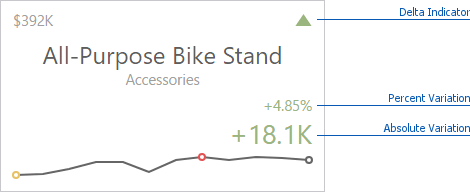
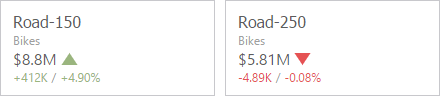
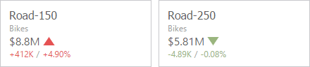

# Delta
Cards allow you to visualize the difference between the [actual and target](providing-data.md) values using special delta values and a delta indicator. If the default layout is used ([Stretched layout type](layout.md)), the card displays the following delta values/elements:

* **Delta Indicator** - Indicates whether the actual value is less or greater than the target value.
* **Percent Variation** and **Absolute Variation** - delta values that show a difference between the actual and target value. You can also display the **Percent of Target** value. To do this, customize the [card's layout](layout.md).

To customize settings that relate to the calculation and display of delta values/elements, invoke the [Binding menu](../../ui-elements/dashboard-item-menu.md), click the required data item in the [Cards](providing-data.md) section and go to **Delta Options** in the [data item's menu](../../ui-elements/data-item-menu.md).

Then, specify the following settings:
* **Result Indication** - You can specify the condition for displaying delta indication.
	* **Greater is Good** - The 'good' indication is displayed if the actual value exceeds the target value; if the target value exceeds the actual value, the 'bad' indication displays.
		
		
	* **Less is Good** - The 'bad' indication displays if the actual value exceeds the target value; if the target value exceeds the actual value, the 'good' indication displays.
		
		
	* **Warning if Greater** - A warning displays only if the actual value exceeds the target value.
		
		
	* **Warning if Less** - A warning displays only if the target value exceeds the actual value.
		
		
	* **No Indication** - Indication does not display.
		
		
* **Threshold type** / **Threshold value** - 
	For instance, you can specify that a specific indication should display when the actual value exceeds the target value _by 10%_ or _by $2K_. Use the **Threshold type** combo box to select whether you wish to specify the comparison tolerance in percentage values or absolute values. Then use the **Threshold value** box to specify the comparison tolerance.