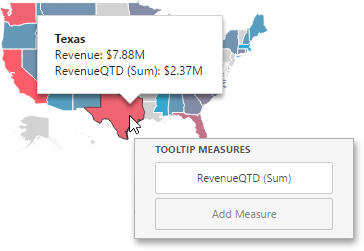

# Providing Data
The **Web Dashboard** allows you to bind various dashboard items to data in a virtually uniform manner. To learn more, see the [Bind Dashboard Items to Data](../../bind-dashboard-items-to-data.md) topic.

The only difference is in the data sections that the required dashboard item has. This topic describes how to bind a **Choropleth Map** dashboard item to data.

## Binding to Data in the Web Dashboard
The image below shows a sample Choropleth Map dashboard item that is bound to data.

To bind the Choropleth Map dashboard item to data, click a placeholder contained in one of the available data sections and select the required data source field in the **Binding** section of the invoked [data item menu](../../ui-elements/data-item-menu.md).

The list below illustrates the Choropleth Map's data sections.
* **Attribute** - Processed as _Dimension_ - Allows you to associate map shapes with data source field values. To learn more about attributes, see the [Map Attributes](providing-maps.md) section.
* **Maps** - Processed as _Measure_ - Contains data items whose values are used to color map shapes. Map shape colors vary based on the map type.
	
	By default, map shapes are colored depending on the provided values. If you add an additional target value, the coloring of map shapes depends on the difference between two values called [Delta](delta.md).
* **Tooltip Measures** - Processed as _Measure_ - Allows you to add supplementary content to the tooltips. Add the required measures to provide additional data.
	
	