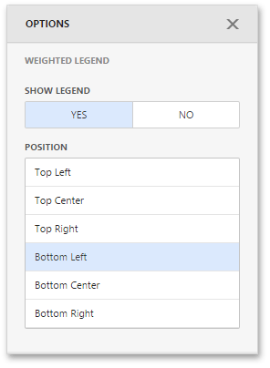

# Legends
The Bubble Map provides two types of legends used to identify map objects - **color** and **weighted** legends.

## Color Legend
The color legend helps you identify which colors correspond to specific values.

To specify color legend settings, go to the **Color Legend** section of the Bubble Map's **Options** menu.

Here you can show or hide the color legend and change its position.

## Weighted Legend
The weighted legend allows you to identify values corresponding to specific bubble sizes.

To specify weighted legend's settings, go to the **Weighted Legend** section of the Bubble Map's **Options** menu.

Here you can show or hide the weighted legend and change its position.