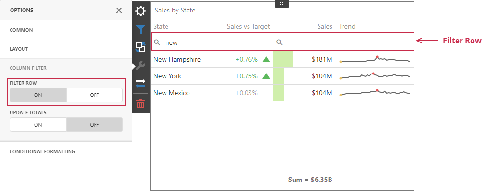

# Column Filter for a Grid Item on the Web

Column filters allow users to search data in the Grid item. These filters do not affect data outside the Grid.

## Filter Row
The **filter row** allows a user to filter data by individual column values. 

Open the grid's [Options](../../ui-elements/dashboard-surface.md) menu and go to the **Column Filter** section to get access to the filter row. When the filter row appears, a user can enter the condition in the text box to filter column values:
    

The filter row's cells can be of different types (for example, text boxes for string and numeric values, calendars for dates, and so on).

## Update Totals

A user can configure a Grid item to reflect changes in column values and recalculate [totals](totals.md) based on the applied column filters. Open the grid's [Options](../../ui-elements/dashboard-menu.md) menu and go to the **Column Filter** section to get access to this setting. As a result, the Grid item recalculates totals depending on the applied column filters:

## Limitations

### Filter Row Limitations
The following Grid [columns](columns.md) do not support the filter row:

- Dimension (for Image display mode only)
- Measure (for Bar display mode only)
- Sparkline
- Delta

A Grid item does not support a filter row for window calculations and calculated fields that use the w-function if the **Update Totals** option is enabled.

### Update Totals Limitations

You cannot enable totals recalculation in OLAP data sources.

### Other Limitations

Although column filters within a Grid item are case-insensitive, totals are calculated on the server and their case-sensitivity setting depends on the database settings. If case-sensitivity settings are different, the total value can differ from the Grid's data. Make sure that the Grid item and the database use the same case-sensitivity settings.