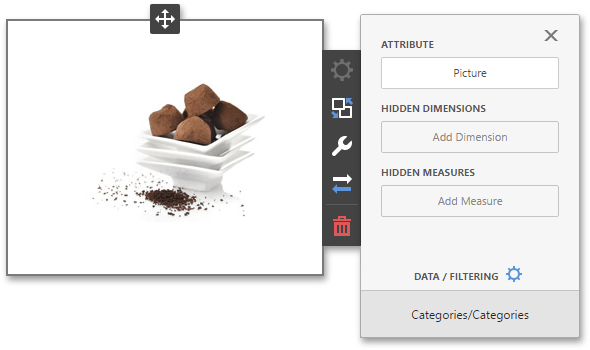

# Providing Images
This topic describes how to provide images for the **Image** and **Bound Image** dashboard items.

## Provide a Static Image
To provide an image to the Image dashboard item, open the Image's [Options](../../ui-elements/dashboard-item-menu.md) menu and specify the image path using **URL** option.

The URL option saves the path to the image in the [dashboard definition](../../save-a-dashboard.md).

## Provide a Set of Images
The **Bound Image** dashboard item provides the **Attribute** data section containing the corresponding placeholder.

You can specify the binding mode for the Bound Image. Go to the Bound Image's [Options](../../ui-elements/dashboard-item-menu.md) menu and specify the **Binding Mode**. The following options are available.
* **Binary Array** - Use this mode if images are stored in the data source as byte arrays.
* **URI** - Use this mode to locate images accessible by a predefined URI. In this case, the data source field should return strings that are parts of URIs to these images. For instance, the URI pattern in the form below specifies the path to the folder containing the required images. 
	
	
	
	_C:\Images\ProductDetailsImages\{0}.jpg_
	
	Data source field values will be inserted to the position of the _{0}_ placeholder. Thus, the Bound Image maps the current dimension value with the image placed at the specified URI.

> [!NOTE]
> Note that the **Bound Image** can display only a single image simultaneously. If Master Filtering is not applied to the Bound Image, it selects the displayed image in the following ways.
> * In the **Binary Array** mode, the displayed image cannot be predicted precisely as a result of sorting limitations for the image/binary data types. Use the [Master Filtering](../../interactivity/master-filtering.md) feature to display the specified image.
> * In the **URI** mode, the Bound Image displays an image corresponding a first attribute value taking into account the attribute's sort order.