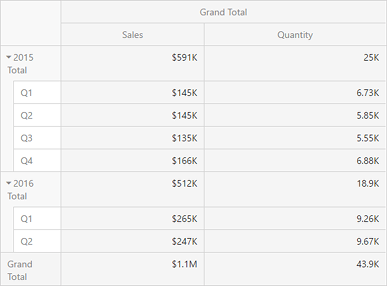
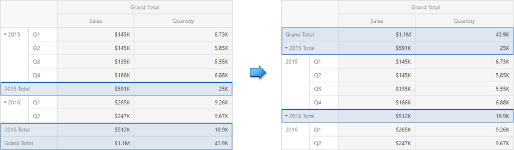
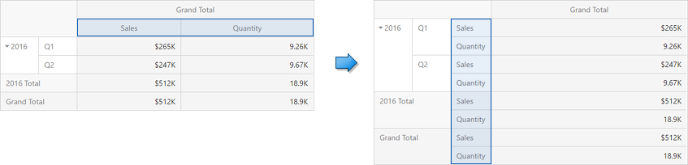

# Layout
This topic describes how to control the Pivot dashboard item layout, the visibility of totals and grand totals, etc.
* [Layout Type](#layouttype)
* [Totals Visibility](#totalsvisibility)
* [Totals Position](#totalsposition)
* [Values Visibility](#valuesvisibility)
* [Values Position](#valuesposition)

## <a name="layouttype"/>Layout Type
If the Pivot dashboard item contains a hierarchy of dimensions in the [Rows](providing-data.md) section, you can specify the layout used to arrange values corresponding to individual groups.

| Layout type | Example | Description |
|---|---|---|
| **Compact** |  | Displays values from different Row dimensions in a single column. Note that in this case totals are displayed at the top of a group, and you cannot change [totals position](#totalsposition). |
| **Tabular** |  | Displays values from different Row dimensions in separate columns. |

To change the Pivot layout, go to **[Options menu](../../ui-elements/dashboard-item-menu.md)** | **Layout** and use the **Layout** option.

## <a name="totalsvisibility"/>Totals Visibility
You can control the visibility of totals and grand totals for the entire Pivot dashboard item. For instance, the image below displays the Pivot dashboard item with the disabled row totals.

To manage the visibility of totals and grand totals, go to **[Options menu](../../ui-elements/dashboard-item-menu.md)** | **Layout** and use the following options:
* **Row Totals** / **Row Grand Totals**
* **Column Totals** / **Column Grand Totals**

Moreover, you can control the visibility of totals for individual dimensions/measures. To do this, go to **[Bindings menu](../../ui-elements/dashboard-item-menu.md)**, select the required data item and use its **Options** | **Show Totals** option.

## <a name="totalsposition"/>Totals Position
If necessary, you can change the position of totals/grand totals for the Pivot dashboard item. For instance, in the Image below the Pivot dashboard item whose row totals are moved from bottom to top.

To manage totals position, go to **[Options menu](../../ui-elements/dashboard-item-menu.md)** | **Layout** and use the following options:
* **Row Totals Position**
* **Column Totals Position**

## <a name="valuesvisibility"/>Values Visibility
The Pivot dashboard item can contain several measures in the [Values](providing-data.md) section. In this case, you can hide summary values corresponding to specific measures. For instance, the image below shows the Pivot with hidden _Quantity_ values.

To do this, go to **[Bindings menu](../../ui-elements/dashboard-item-menu.md)**, select the required measure and use its **Options** | **Show Values** option.

## <a name="valuesposition"/>Values Position
The Pivot dashboard item allows you to control the position of headers used to arrange summary values corresponding to different measures. For instance, you can display values in columns or in rows.

To manage this position, go to **[Options menu](../../ui-elements/dashboard-item-menu.md)** | **Layout** and use the **Values Position** option.