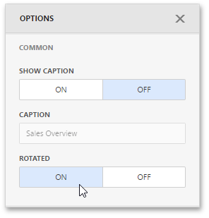

# Orientation
You can rotate the Scatter Chart so that the [X-axis](axes.md) becomes vertical, and the [Y-axis](axes.md) becomes horizontal.

To rotate a Scatter Chart in the Web Dashboard, open the Scatter Chart's [Options](../../ui-elements/dashboard-item-menu.md) menu and go to **Common** section. Then, turn the **Rotated** option on.

