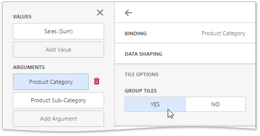

# Grouping
If you use several arguments in the Treemap, you can group tiles corresponding to child values by parent values. For example, the following Treemap dashboard item displays combinations of categories and sub-categories.

To group sub-categories inside corresponding categories, click the _Product Category_ data item and go to the **Tile Options** section of the [data item menu](../../ui-elements/data-item-menu.md). There, toggle the **Group Tiles** option on.

Product tiles will be grouped into category groups.

> [!NOTE]
> Note that grouping is unavailable for the bottommost level.