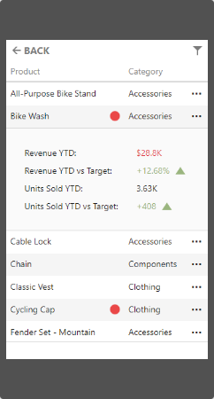

# Mobile Layout

This topic describes the Web Dashboard's mobile layout that enables you to display dashboards on mobile phones.

- [Mobile Layout's Views](#mobile-layouts-views)
- [Dashboard Items Behavior](#dashboard-items-behavior)

> [!Note]
> You can [export](exporting.md) only dashboard items when the Web Dashboard displays dashboards on mobile phones.

## Mobile Layout's Views

Web Dashboard in the mobile layout consists of the following views:

### List View

The **List view** displays all dashboard items used in the current dashboard. The item's interactivity is disabled. Filter elements are not displayed in the List view (see [Dashboard Items Behavior](#dashboard-items-behavior)).

 

### Item View
The **Item view** displays the selected item. Interactivity is supported. Filter elements are not displayed in the Item view (see [Dashboard Items Behavior](#dashboard-items-behavior)).

### Filter Panel
The **Filter panel** displays filters that are applied to the entire dashboard / dashboard items. Click the **Filter** button (the  icon) in the List view / Item view to see the filters applied to the entire dashboard / dashboard item, respectively. Click the required filter in the Filter panel to open the corresponding filter element and filter data.

 

## Dashboard Items Behavior

The items listed below are displayed with the following specifics when used in the mobile layout:

### [Grid](dashboard-items/grid.md)

- The Grid always adjusts columns automatically to the minimum width required to completely display its content.
- Grid hides columns to adapt the content to the screen or container size. Click the ellipsis button in the Grid's row to display hidden data inside the adaptive detail row.
- The default column fit of the sparkline and bars is two times tighter then in a desktop version.
- Column resizing is disabled.

### [Cards](dashboard-items/cards.md)

- Cards in the mobile layout are always arranged automatically.

### [Filter Elements](dashboard-items/filter-elements.md)

- Filter elements are displayed only in the Filter panel and are hidden in the List and Item views.
