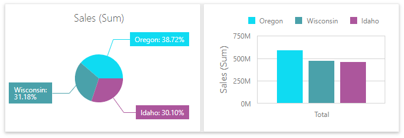
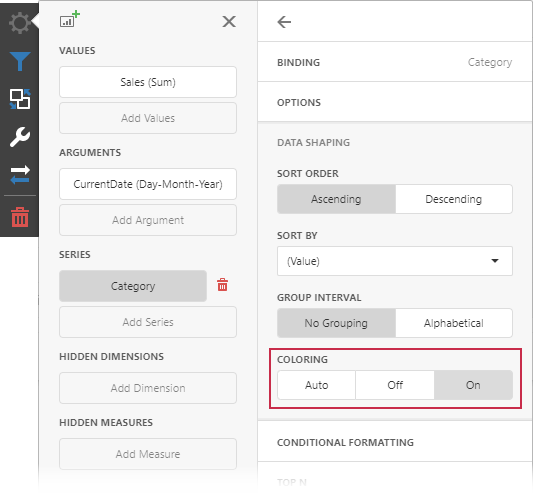
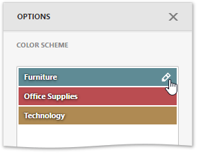
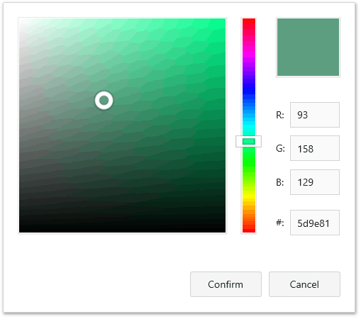
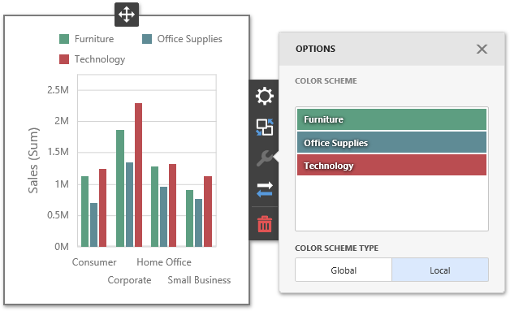
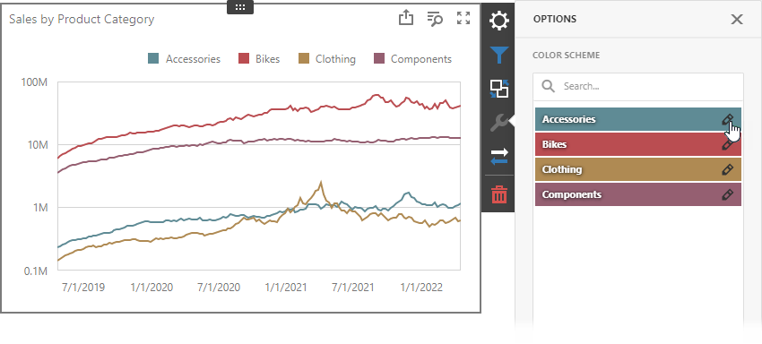
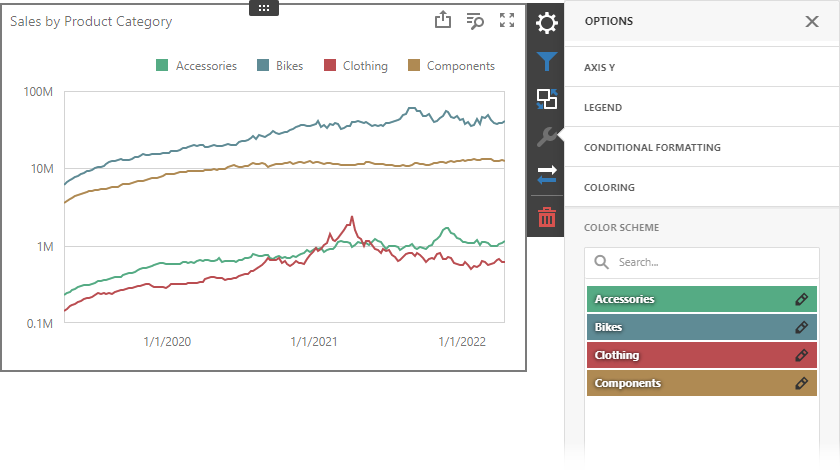
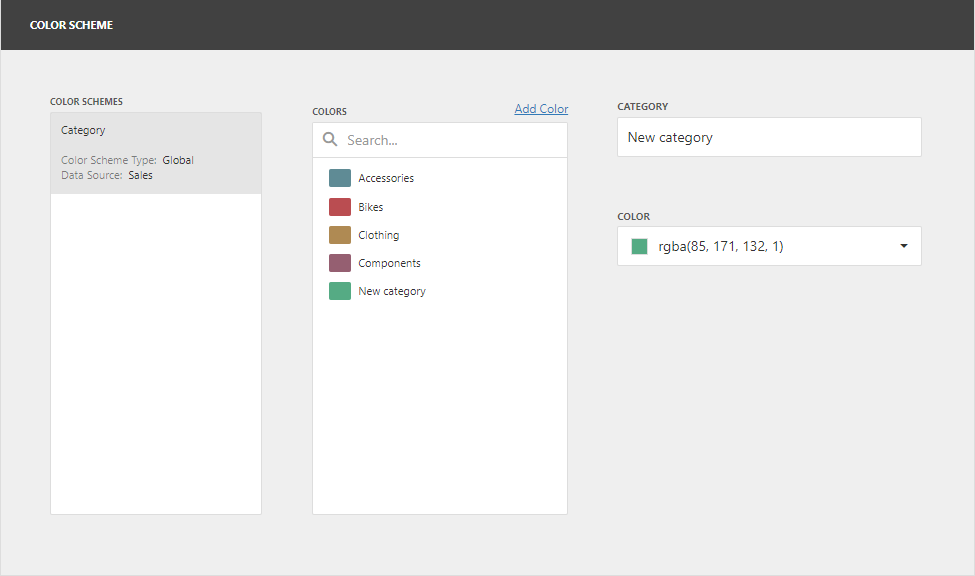
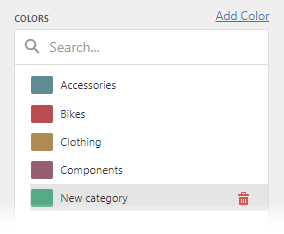

---
title: Coloring
author: Natalia Kazakova
legacyId: 117565
---
# Coloring
The Web Dashboard provides the capability to manage the coloring of dashboard item elements, such as chart series points or pie segments.

## Supported Dashboard Items
You can manage coloring for the following dashboard items.
* [Chart](../dashboard-item-settings/chart.md)
* [Scatter Chart](../dashboard-item-settings/scatter-chart.md)
* [Pie](../dashboard-item-settings/pies.md)
* [Pie Map](../dashboard-item-settings/geo-point-maps/pie-map.md)
* [Range Filter](../dashboard-item-settings/range-filter.md)
* [Treemap](../dashboard-item-settings/treemap.md)

## Color Schemes Overview
The dashboard supports two ways to color dashboard item elements:

* **Global color scheme**. This scheme uses consistent colors for identical values across the dashboard. The image below shows a dashboard that contains Pie and Chart dashboard items. Pie segments and chart series points that correspond to Wisconsin, Oregon and Idaho dimension values use identical colors from the default palette.

    

    For a global color scheme, the dashboard reserves automatically generated colors for specific values regardless of the filter state.

* **Local color scheme**. This scheme uses an independent set of colors for each dashboard item. The image below shows Pie segments that use colors from a local color scheme. These colors do not affect the Chart item that uses a global scheme.

    

    For a Local color scheme, the dashboard reassigns palette colors when the filter state is changed.

## Color Measures and Dimensions

You can configure color modes as follows:

- A specific data item - To specify the color mode for a specific measure/dimension, open the [data item menu](../ui-elements/data-item-menu.md) and go to the **Data Shaping** section. Use the **Coloring** option to specify the color mode of this data item.
	
	
- All data items - To see a list of all measures/dimensions for which you can specify color mode in a dashboard item, open the dashboard item's [Options](../ui-elements/dashboard-item-menu.md) menu and go to the **Coloring** section. 
	
	

For example, the image below shows the Chart dashboard item whose _Country_ **dimension** is colored by different hues:

And the following Pie dashboard item colors **measures** by different hues:

> [!NOTE]
> If you enable color variation by different hues for several dimensions/measures, all combinations of dimension values/measures are colored with different colors from the default palette.

## Customizing Color Palettes Using the Dashboard Item Menu
The Web Dashboard allows you to customize colors of the specific palette using the **Color Scheme** section of the dashboard item [Options](../ui-elements/dashboard-item-menu.md) menu. To edit the color scheme, click the **Edit** button (the  icon) of the corresponding color.

Then, pick any color using the RGB color model in the invoked color picker and click **Confirm** to change the color.

A new color scheme will be applied to the dashboard item(s).

## Dashboard Item Color Mode Specifics

The following table describes how colors are applied based on the dashboard item's type.

| Item's Name | Coloring Specifics |
| -- | -- |
| **Chart** | The Chart colors different measures and series dimensions by hue. |
| **Scatter Chart** |The Scatter Chart does not color its arguments. |
| **Pies** |  If the Pie dashboard item contains measures (the _Values_ section) and series dimensions (the _Series_ section), only values that correspond to different measures are colored by hue.    If the Pie dashboard item contains arguments (the _Arguments_ section), different argument values are colored by hue. |
|**Choropleth Map** | The Choropleth Map automatically selects palette and scale settings to color map shapes. |
|**Bubble Map** | The Bubble Map automatically selects palette and scale settings used to color bubbles depending on the provided values.
| **Pie Map** |  The Pie Map allows you to color segments that correspond to various dimension values/measures. |
| **Range Filter** |  The Range Filter colors different measures and series dimensions by hue. |
| **Treemap** |  If the Treemap contains only measures (the _Values_ section), values that correspond to different measures are colored by different hues.   If the Treemap contains arguments (the _Arguments_ section), values that correspond to the first argument are colored by different hues. |

To change the default coloring behavior, you can [configure color modes](#color-measures-and-dimensions).

## Conditional Formatting

The DevExpress Dashboard allows you to format [dashboard item](../../web-dashboard-viewer-mode/dashboard-items.md) elements whose values meet a specified condition. This feature highlights specific elements with a predefined set of rules. 

Refer to the following article for more information about conditional formatting: [Conditional Formatting](../appearance-customization/conditional-formatting.md).

## Switch between Global and Local Color Schemes

The dashboard supports two ways to color dashboard item elements:
- A **Global Color Scheme** uses consistent colors for identical values across the dashboard.
- A **Local Color Scheme** uses an independent set of colors for each dashboard item.

To switch between global and local color schemes in the Web Dashboard, open the dashboard item's [Option](../ui-elements/dashboard-menu.md) menu, go to the *Color Scheme* section, and select the Color Scheme type.

>[!TIP]
> The **local** color scheme paints dashboard item elements more quickly because the control does not request all possible colors and requests only colors used in the current item.

## Customize Color Palettes in the Dashboard Item Menu

Use the **Color Scheme** section of the dashboard item [Option](../ui-elements/dashboard-menu.md) menu to customize colors of the specific palette. To edit the color scheme, click the **Edit** button  of the corresponding color.

Then, pick any color in the RGB color model of the invoked color picker and click **Confirm** to change the color.

A new color scheme is applied to the dashboard item(s).

## Customize Color Palettes in the Color Scheme Page

The **Color Scheme** page of the [dashboard menu](../ui-elements/dashboard-menu.md) allows you to edit and add colors to customize color tables.

### Edit Colors

You can reassign a color in the selected color table. For this, select one of the available schemes in the **Color Schemes** pane and click the color in the **Colors** pane to invoke the **Color** combo box.
	
If you click the **Color** dropdown button, it invokes a color picker where you can specify a new color. 

Click **OK** to change the automatically assigned color for the selected value and update the current color scheme.

### Add Colors

The Color Scheme page allows you to add a new value with the specified color to the selected color scheme. To do this, use the **Add color** button.

Specify the dimension value of the added color or select the measures. This creates a new value whose color can be specified as described in the **Edit colors** section.

Hover over the custom color and click **Remove** (the  icon) to remove the color.

