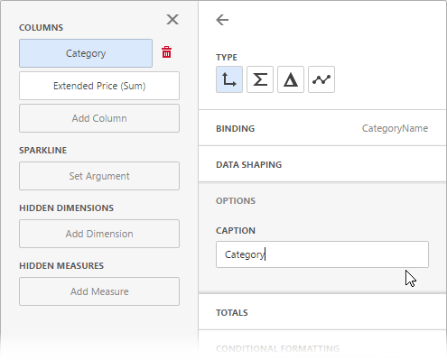
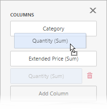
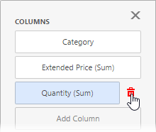

---
title: Bind Dashboard Items to Data in the Web Dashboard
author: Natalia Kazakova
legacyId: 117956
---
# Bind Dashboard Items to Data in the Web Dashboard
This topic explains how to bind the [newly created dashboard item](../add-dashboard-items.md) to data source fields to visualize data.

## Create Binding
Invoke the [Binding](../ui-elements/dashboard-menu.md) menu. The image below displays a [Grid](../dashboard-item-settings/grid.md) dashboard item that is bound to an _SQL Data Source_ | _Sales Person_ query:

Click a placeholder and select the data source field to bind a dashboard item to data:

To rename the data item's caption, go to the data item's **Options** section:

> [!TIP]
> For information on how to bind a specific dashboard item to data, see the corresponding **Providing Data** help topic: [dashboard item settings](../dashboard-item-settings.md).

## Modify Binding
You can use drag-and-drop to change the data binding order:

## Clear Binding
To remove the data item, select it and click the **Remove** () button next to this data item.

## Specify a Data Source
A dashboard can have several [data sources](../provide-data/manage-data-sources.md). To change the default data source (or a query / data member ), go to the dashboard item's [Binding](../ui-elements/dashboard-menu.md) menu and click the **Data Source** button.

In the invoked section, change the data source (query / data member) and click **OK**.

When you change the dashboard item's data source, data items try to display data from the same column of the new data source. If such a column does not exist, you get the red color indication for this data item. Select a new data source field for this data item.