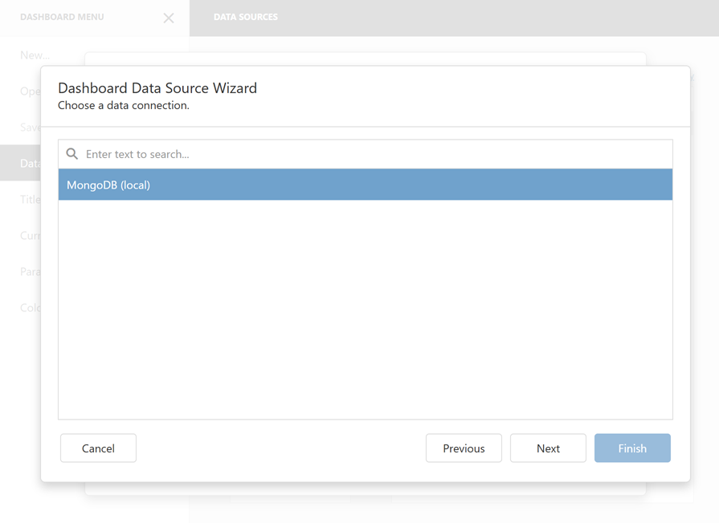

# Specify Data Source Settings (MongoDB)

The following page is available for the OLAP data source type:

## Select a Data Connection

Specify the data connection and click **Next**:

## Configure Queries

Configure queries and click **Next**.

## Select Data Fields

Select data fields and click **Finish**.

