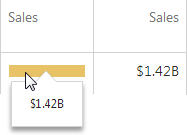

---
title: Data Presentation Basics
author: Natalia Kazakova
legacyId: 16734
---
# Data Presentation Basics
The **Grid** displays data in a two-dimensional table that supports four types of columns.

* The **dimension column** displays values from the bound data item "as is".
* The **measure column** displays summaries calculated from data in the bound data item.
* The **delta column**, bound to two measures, calculates summaries for both measures, and displays the difference between these summaries.
* The **sparkline column** visualizes the variation of summary values over time.

## Sort Grid Rows
To sort records by a column's values and replace the existing sort conditions applied to the current or other columns, click the target column's header until the _Up_ or _Down_ arrow icon is displayed within the header. The _Up_ and _Down_ arrows indicate ascending and descending sort orders, respectively.

You can also apply the required sort condition by right-clicking a column header and selecting **Sort Ascending** or **Sort Descending** from the invoked context menu.

To remove sorting by a column, select **Clear Sorting** from the context menu or click a column header while holding down the **CTRL** key.

## Tooltips
A Grid dashboard item can display a tooltip when the mouse pointer is hovered over the bar in the measure column.

The tooltip shows the value in the measure column as text.

When the mouse pointer is hovered over the cell in the sparkline column, the tooltip can display start/end values and minimum/maximum values.

