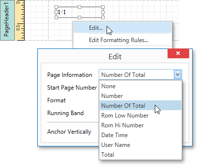
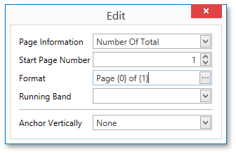

# Add Page Numbers and System Information to a Report
This document describes how to insert _page numbers_ or other system information (e.g., _current date and time_, _user name_, etc.) into a report.

Generally, this information is displayed within the Page Header and Footer or Page Margin [bands](../../report-elements/report-bands.md). To add page numbers or system information to a report, drop the [Page Info](../../report-elements/report-controls.md) control from the [Control Toolbox](../../interface-elements/control-toolbox.md) onto a band.

Then, follow the instructions below for your specific task.
* [Add Page Numbers](#pagenumbers)
* [Add System Date and Time](#datetime)
* [Add the User Name](#username)

<a name="pagenumbers"/>

## Add Page Numbers
To insert page numbers in a report, do the following.
1. Right-click the **Page Info** control, and in the context menu, click the **Edit...** link. Then, in the invoked dialog, specify the **Page Information** property.
	
	
	
	You can choose one of the following formats for displaying page numbers.
	* **Number** - displays the current page number only.
	* **Number of Total** - displays the current page number with total pages.
	* **Rom Low Number** - the current page number is written in lowercase Roman letters.
	* **Rom Hi Number** - the current page number is written in uppercase Roman letters.
	* **Total** - displays the total number of pages.
2. To format the control's text, in the **Edit** dialog, specify the required format (e.g., **Page {0} of {1}**).
	
	
3. You can also specify the **Start Page Number** and **Running Band** properties. For instance, the latter is available when there are [groups](../shaping-data/grouping-data.md) in a report, and you are required to apply independent page numbering for them.

The result is shown below.

<a name="datetime"/>

## Add System Date and Time
To insert the current system date and time into a report, perform the steps below.
1. Right-click the **Page Info** control and select **Edit...** in the context menu. In the invoked dialog, expand the **Page Information** drop-down and select **Date Time**.
	
	
2. To [format](../shaping-data/formatting-data.md) the control's text, you can either type it in the **Format** property, or click its ellipsis button and use the **Format String Editor**.
	
	

The result is shown below.

<a name="username"/>

## Add the User Name
To display the current user name in a report, do the following.
1. Right-click the **Page Info** control and select **Edit...** in the context menu. In the invoked dialog, expand the **Page Information** drop-down and select **User Name**.
	
	
2. To format the control's text, in the **Edit** dialog, specify the required format (e.g., **Current User: {0}**).
	
	

The following image demonstrates the result.

