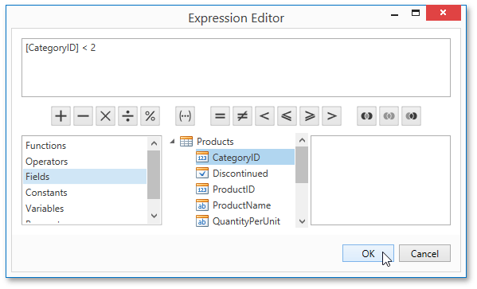

# Conditionally Hide Bands
This tutorial describes how to hide bands if a certain logical condition is met. Note that no [scripts](../scripting.md) are required to accomplish this task.

To demonstrate this feature, use a report with grouping similar to the one created in the following tutorial: [Grouping Data](../shaping-data/grouping-data.md).

To conditionally hide bands in a report, do the following.
1. Right-click the [Group Header](../../report-elements/report-bands.md) and select **Edit Formatting Rules...** in its context menu.
	
	
2. In the invoked **Formatting Rules Editor**, click the **Edit Rule Sheet...** button.
	
	
3. Then, in the invoked **Formatting Rule Sheet Editor**, click the plus button to create a new rule. Set its **Visible** property to **No**, and click the ellipsis button for the **Condition** property.
	
	
4. Construct the required logical expression (e.g., **[CategoryID] &lt; 2**), and click **OK**.
	
	
	
	To quit the **Formatting Rule Sheet Editor** and save changes, click **OK**.
5. Return to the **Formatting Rules Editor** and move the created rule to the dialog's right section using the right arrow button to make it active.
	
	
6. Apply the same formatting rule to the report's Detail band.

Switch to the [Print Preview](../../document-preview.md) and view the result. In this example, you can see that the first category is not shown. So, the conditional formatting was applied properly.

