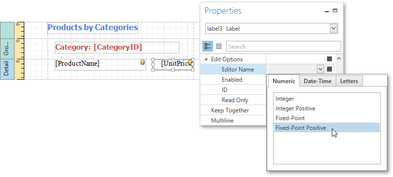
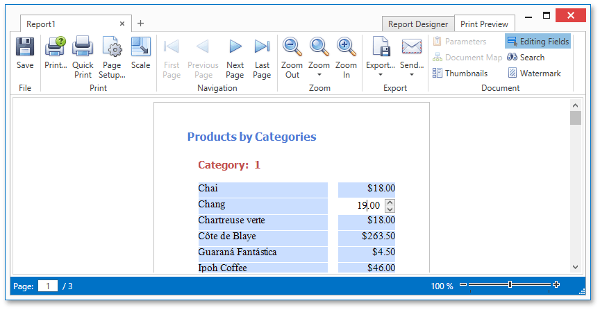
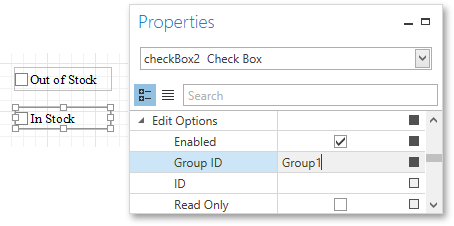

# Enable Content Editing in Print Preview
This document describes how to enable editing the content of specific controls in [Print Preview](../../document-preview.md).

This topic consists of the following sections.
* [Text Editing](#textediting)
* [Check Box Editing](#checkboxediting)

## <a name="textediting"/>Text Editing
The **Label**, **Table Cell** and **Character Comb** [report controls](../../report-elements/report-controls.md) can be assigned editors to customize their content in Print Preview.

To demonstrate this feature, use the report similar to one created in the following tutorial: [Grouping Data](../shaping-data/grouping-data.md).

To enable content editing, do the following.
1. Select one or more controls that you want to become editable in Print Preview (to select multiple controls, click them while holding down CTRL or SHIFT).
	
	Switch to the [Properties Panel](../../interface-elements/properties-panel.md), expand the **Edit Options** property and select the check box for the **Enabled** property.
	
	
2. To provide a mask for editing decimal values of the **UnitPrice** field, set the **Editor Name** property to **Fixed-Point Positive** to assign the required editor with a corresponding mask.
	
	

Switch to the [Print Preview](../../document-preview.md) tab. To highlight all editing fields available in the document, click the **Editing Fields**  button in the Print Preview toolbar.

Clicking a field will invoke the appropriate editor. To apply the entered values and navigate between editing fields, use the TAB and SHIFT+TAB keys.

## <a name="checkboxediting"/>Check Box Editing
In addition to editing text, you can enable switching [Check Box](../../report-elements/report-controls.md) states in Print Preview. When two or more check boxes have identical **Group ID** values, the corresponding editors belong to a single logical group (i.e., only one option can be selected within a group at a time).

> [!NOTE]
> The changes made to a control's content in Print Preview have no effect on other parts of the document (e.g., the related summary results, grouping, sorting, bookmarks and other settings that have already been processed before generating the document).