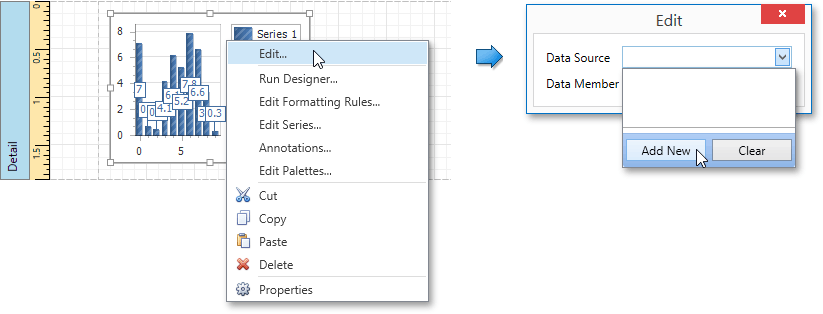
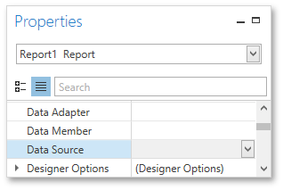

# Chart with Static Series
This document describes how to create a report with a [Chart](../report-elements/report-controls.md) control bound to data, so that a particular series has its own data source, and other settings. To simplify the example, both series obtain their data from the same data source. However, different data sources can be used for different series, if necessary.

This example describes how to construct a chart of products and their prices for a chosen category.

To adjust a Chart by manually creating its series, do the following.
1. [Create a new blank report](../creating-reports/basic-operations/create-a-new-report.md).
2. Drop the [Chart](../report-elements/report-controls.md) control from the [Toolbox](../interface-elements/control-toolbox.md) onto the report's [Detail band](../report-elements/report-bands.md).
	
	
	
	After you drop the Chart, the **Chart Designer** is automatically invoked. At this step, click **Cancel** to close the Designer, it will be used later.
3. To bind the Chart to a data source, right-click it and select **Edit...** in the context menu. Then, in the invoked dialog, expand the **Data Source** drop-down and click **Add New**.
	
	
	
	The invoked **Data Source Wizard** will guide you through the process of assigning a data source to the Chart. For detailed instructions on the Wizard's steps, refer to [Binding a Report to Data](../creating-reports/providing-data/binding-a-report-to-data.md), as this process is similar.
	
	After the data source is created, it is assigned to the Chart's **Data Source** property. Its **Data Member** property defines from which table or view of your data source the Chart obtains its data.
	
	
	
	> [!NOTE]
	> Since you have placed the Chart in the Detail band, the report's **Data Source** property should not be set. Otherwise, the Chart will be repeated at the preview as many times as there are records in the data source.
	> 
	> 
4. Once again, right-click the Chart and select **Run Designer...** in the context menu.
	
	
5. The invoked **Chart Designer** already contains one series of the **Bar** view type. To populate the series with points, select it in the tree and switch to the **Data** tab at the right of the designer's window. Choose an existing data source in the dedicated drop-down list. Then, drag-and-drop the required data fields to the **Argument** and **Value** cells to define the coordinates for series points.
	
	
6. Go to the **Properties** tab to see that the **Argument Data Member** and **Value Data Members** settings are automatically assigned to the corresponding fields.
	
	In addition, you can filter the series data. To do this, click the ellipsis button for the **Data Filters** property, and in the invoked dialog, create and adjust the filtering criteria.
	
	
	
	To save the changes and quit the dialog, click **Close.**
7. Create one more series with the same settings, but select the **Point** view type. To do this, locate the **Series** element in the chart elements tree and click the plus button. In the invoked list of series types, select the required type.
	
	
8. Finally, to improve your Chart's appearance, you can make the following adjustments.
	* Remove the Chart's legend as it shows the same data for both series. To do this, select the Legend in the chart elements tree, and in the **Options** tab, set the **Visibility** property to **No**.
	* The point labels for **Series 1** are unnecessary, so select the **Label** node under this series and disable the **Labels Visibility** check box.
	* Rotate the X-axis labels for better readability. To do this, select the **Axis X** item, and in the **Properties** tab, adjust settings for labels using the **Label** property. For instance, set the **Angle** property to **20** and the **Antialiasing** property to **Yes**.
	
	If required, it is possible to customize many other properties for the Chart, which are not described here.

The chart is now ready. Switch to the [Print Preview](../document-preview.md) and view the result.

