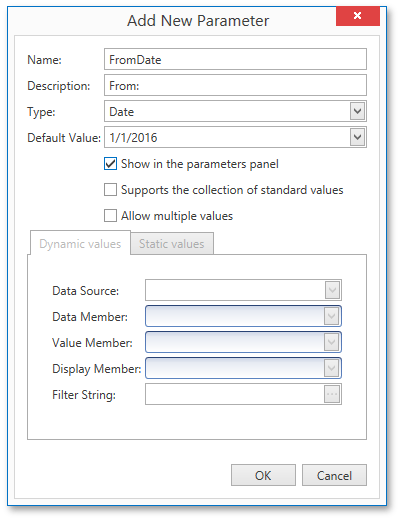
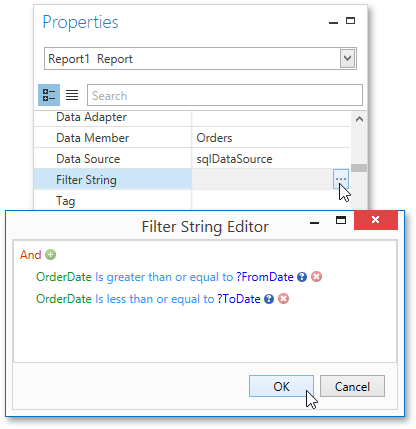

# Parametrized Report
This tutorial describes the steps needed to create a report with parameters. In this example, two date-time parameters are created to filter out orders that don't fall in the specified range from the report.

To create report parameters, follow the steps below.
1. [Create a new report](../creating-reports/basic-operations/create-a-new-report.md) and bind it to a data source.
2. In the [Field List](../interface-elements/field-list.md) panel, right-click the **Parameters** section and in the invoked menu, click **Add Parameter**.
	
	
3. In the invoked **Add New Parameter** dialog, set the created parameter's **Name** and **Description** properties and make sure to set its **Type** to an appropriate value. To display this parameter in the [Print Preview](../document-preview.md), enable the **Show in the parameters panel** option.
	
	
4. To assign a list of values to this report parameter, enable the **Supports the collection of standard values** option.
	
	In the **Dynamic values** tab, you can specify a parameter's data source, data member, value member and display member. The value member defines a data field that provides values to the parameter. The display member defines a data field that provides display names for parameter values, i.e., how these values appear in the user interface available in a [Print Preview](../document-preview.md).
	
	In the **Static values** tab, you can manually fill the list of parameter values. Each parameter value has an individual description specifying how this value appears in the [Parameters Panel](../document-preview/parameters-panel.md).
	
	
5. Then, repeat the previous steps to create the second parameter, so that every time your report is previewed, you will be asked to specify two dates.
6. Next, use parameters to filter your report's data. Select report, and in the [Properties Panel](../interface-elements/properties-panel.md), click the ellipsis button for the **Filter String** property. Then, in the invoked **Filter String Editor**, construct an expression where a data field is compared with the created parameters. To access parameters, click the icon on the right until it turns into a question mark.
	
	

The Parametrized report is now ready. Switch to the [Print Preview](../document-preview.md) tab, define the required values in the **Parameters** panel and click **Submit**.

