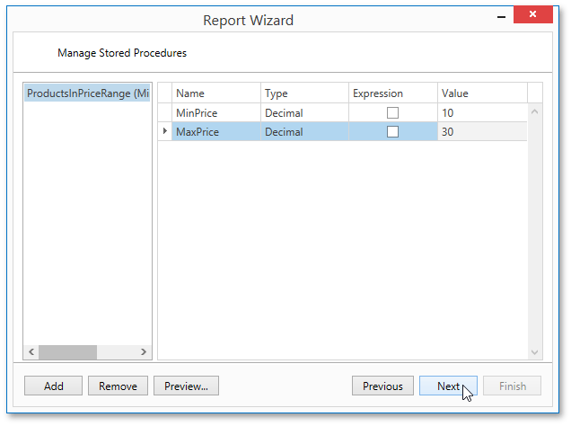

# Bind to a Stored Procedure
This wizard page allows you to add stored procedures to the data source and configure their parameters. Note that this page is available only if the current Entity Framework model provides at least one stored procedure.

To add a stored procedure, click **Add** and in the invoked dialog, select the required stored procedure from the list of available procedures.

Next, specify stored procedure parameter values, which can be either static or generated by appropriate expressions.

Click **Next** to proceed to the next wizard page. If you have added more than one stored procedures on this page or if the current Entity Framework model additionally provides data tables, go to the [Select a Data Member](select-a-data-member.md) page. Otherwise, proceed to the [Choose Columns to Display in a Report](../choose-columns-to-display-in-a-report.md) page.