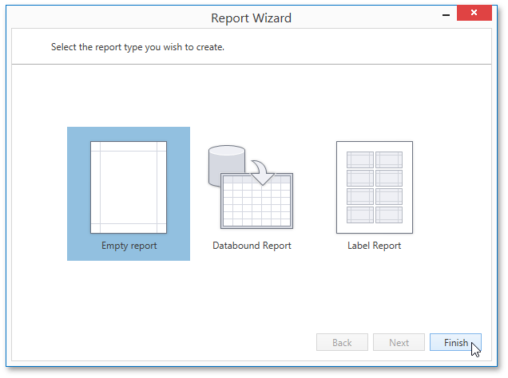

# Empty Report
The **Report Wizard** allows you to create reports of three kinds: **empty reports**, [data-bound reports](data-bound-report.md) and [label reports](label-report.md). To create a new blank report, select **Empty Report** and click **Finish**.

The created report is not bound to a data source and doesn't contain any report controls. The following image demonstrates the default layout of this report.

You can then [bind the report to a required data source](../creating-reports/providing-data/binding-a-report-to-data.md) and [construct the report layout](../creating-reports/basic-operations/adjust-the-layout-of-report-elements.md).