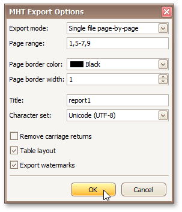

# MHT-Specific Export Options
When [exporting a document](exporting-from-print-preview.md), you can define MHT-specific exporting options using the following dialog.

* **Export mode**
	
	Specifies how a document is exported to MHT. The following modes are available.
	* The **Single file** mode allows you to export a document to a single file, without dividing it into pages.
	* The **Single file page-by-page** mode allows you to export a document to a single file, divided into pages. In this mode, the **Page range**, **Page border color** and **Page border width** options are available.
	* The **Different files** mode allows you to export a document to multiple files, one for each document page. In this mode, the **Page range**, **Page border color** and **Page border width** options are available.
* **Page range**
	
	Specifies a range of pages which will be included in the resulting file. To separate page numbers, use commas. To set page ranges, use hyphens.
* **Page border color**
	
	Specifies page border color.
* **Page border width**
	
	Specifies page border width (in pixels).
* **Title**
	
	Specifies the title of the created document.
* **Character set**
	
	Specifies the character set for the HTML document.
* **Remove carriage returns**
	
	Specifies whether to remove carriage returns.
* **Table layout**
	
	Specifies whether to use a table or non-table layout in the resulting document.
* **Export watermarks**
	
	Specifies whether to export watermarks to HTML along with the rest of the document content.