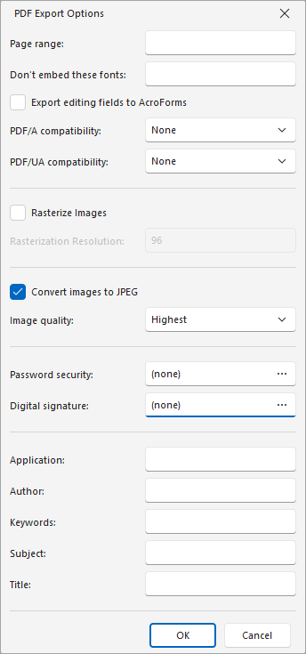

# PDF-Specific Export Options

When [exporting a document](exporting-from-print-preview.md), you can configure PDF-specific export options using the following dialog.

## General Options

* **Page range**
	
	Specifies a range of pages that will be included in the resulting file. To separate page numbers, use commas. To set page ranges, use hyphens.
* **Don't embed these fonts**
	
	Specifies font names that should not be embedded into the resulting file to reduce the file size. To separate fonts, use semicolons.
* **Export editing fields to AcroForms**

	Specifies whether to convert a report's editing fields to interactive form fields (AcroForms) in the exported PDF.
* **PDF/A compatibility**
	
	Specifies document compatibility with the PDF/A specification (PDF/A-1a, PDF/A-1b, PDF/A-2a, PDF/A-2b, PDF/A-3a, PDF/A-3b).
* **PDF/UA compatibility**

	Specifies whether to conform the exported PDF document to the PDF/UA (Universal Accessibility) standard. The following values are available:
	* **PDF/UA-1** — based on **ISO 14289-1** and PDF 1.7.
	* **PDF/UA-2** — based on **ISO 14289-2** and PDF 2.0.
* **Rasterize Images**

	Specifies whether to rasterize vector images during export.
* **Rasterization Resolution**

	Specifies the resolution (in DPI) used for rasterized images.
* **Convert images to JPEG**
	
	Specifies whether to convert all bitmaps to JPEG format during export.
* **Image quality**
	
	Specifies the document's image quality level. The higher the quality, the bigger the file, and vice versa.

## Password Security

Click the **...** button next to **Password security** to open the **Password Security** dialog. You can require a password to open the document and restrict editing, printing, and copying. Use the **Encryption Level** option to specify the encryption algorithm (128-bit AES, 256-bit AES, or 128-bit ARC4).

## Digital Signature

Click the **...** button next to **Digital signature** to open the **Signature Options** dialog. Select a **Certificate** to sign the document, optionally load a signature **Image**, and fill in the **Reason**, **Location**, **Accessible Description**, and **Contact Information** fields.

## Additional Options

You can also fill the **Application**, **Author**, **Keywords**, **Subject**, and **Title** fields. These options specify the **Document Properties** of the created PDF file.