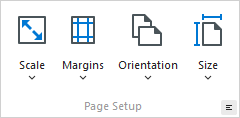
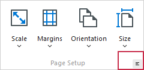
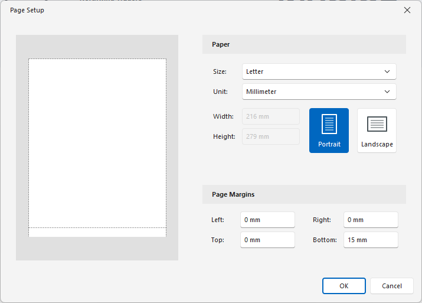

# Change Printing Settings via the Page Setup Dialog

You can specify page settings in one of the following ways:

* Use buttons in the **Page Setup** group.

    

* Click the **Page Setup**  button on the toolbar.

    

    The following dialog will be invoked.

    

    This dialog allows you to do the following:
    * Change page orientation (choose Portrait or Landscape).
    * Select paper size and measure unit.
    * Change page margins. 

> [!NOTE]
> If you're working with a document that was [loaded from file](../file-management/load-a-print-preview-from-a-file.md), the **Page Setup** commands on the toolbar and main menu will be disabled.