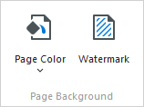
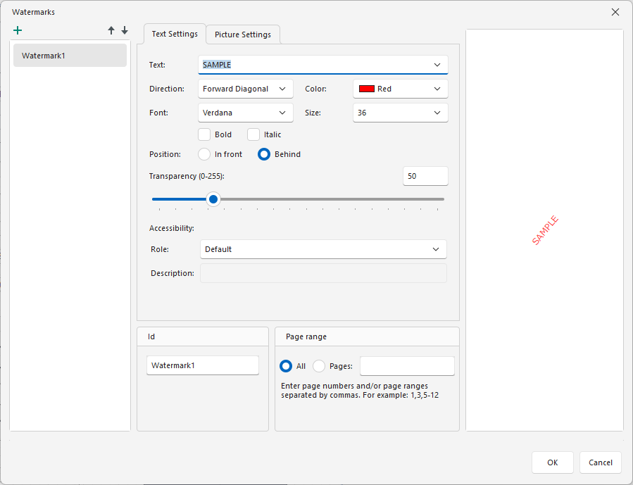
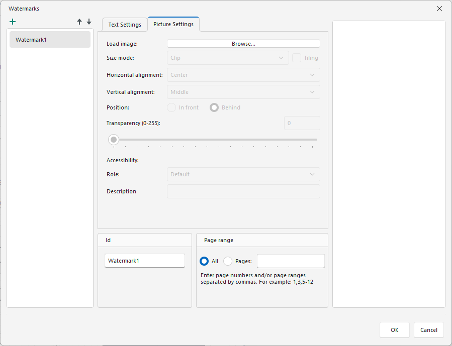
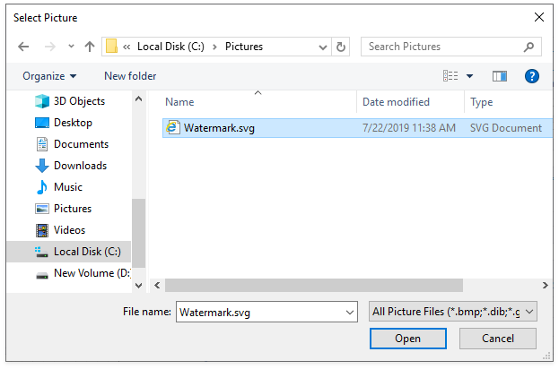
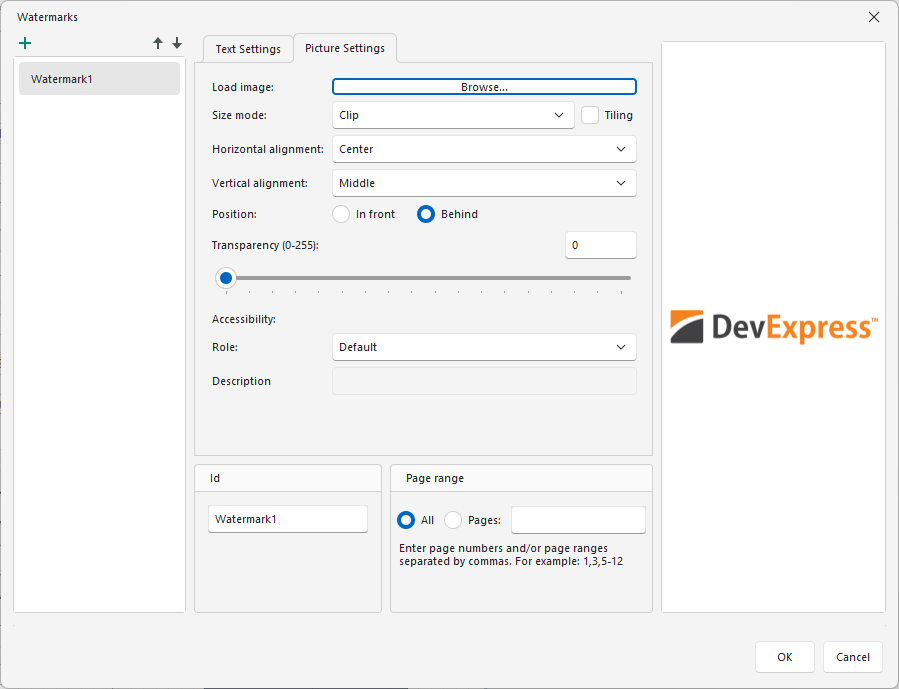
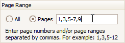
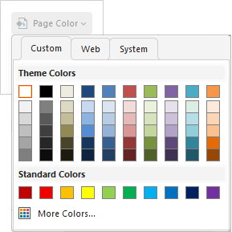

# Change Watermark and Background Settings in Print Preview

## Invoke the Watermark Dialog
To add a watermark to a document, click the **Watermark** button on the toolbar:

The **Watermark** dialog will be invoked.

## Add a Text Watermark

To add a text watermark, open the **Text Watermark** tab. 

Specify the following settings:

* Text

	The watermark’s text.

* Direction

	The incline of the watermark’s text.

* Font

	The font of the watermark’s text.

* Color

	The foreground color of the watermark’s text.

* Size

	The size of the watermark’s text.

* Bold

	Formats the watermark’s text as bold.

* Italic

	Formats the watermark’s text as italic.

* Position

	Specifies whether a watermark should be printed behind or in front of page content.

* Transparency

	The transparency of the watermark’s text.

* Id

	The unique identifier of a watermark used to specify the watermark in the WatermarkId property (See the Manage Watermark Collection section for details).

* Page Range

	The range of pages which contain a watermark.

* Role

	Specifies the role of a text watermark in the exported PDF document. This value is used by assistive technologies.

* Description

	Specifies the description of a text watermark used by assistive technologies.	

## Add an Image Watermark

Specify an image. Click the **Load image** option’s **Browse** button.

	
In the invoked **Select Picture** dialog, select the file containing the image that you wish to use as a watermark and click **Open**.
	

Specify the following picture options:

* Size Mode

	The mode in which a picture watermark is displayed.

* Tiling

	Specifies whether a picture watermark should be tiled.

* Horizontal Alignment

	Specifies the horizontal alignment of the watermark.

* Vertical Alignment

	Specifies the vertical alignment of the watermark.

* Position

	Specifies whether a watermark should be printed behind or in front of page content.

* Transparency

	The transparency of the watermark’s image. The **Transparency** property is unavailable when you specify an SVG image.

* Id

	The unique identifier of a watermark used to specify the watermark in the WatermarkId property (See the Manage Watermark Collection section for details).

* Page Range

	The range of pages which contain a watermark.

* Role

	Specifies the role of an image watermark in the exported PDF document. This value is used by assistive technologies.

* Description

	Specifies the description of an image watermark used by assistive technologies.			

> [!NOTE]
> A report can display only one watermark on a report page.	

## Specify the Pages Where you will Display Your Watermark

Specify the required pages to apply a watermark in the **Page Range** section of the dialog.

Separate page numbers with commas, or specify page ranges using a dash.

## Add a Background Color to a Document

To add a background color to a document, click the **Page Color** button on the toolbar. The **Page Color** dialog will be invoked.

Then, choose a color from the **Custom**, **Web**, or **System** palettes.