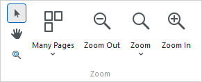

# Zoom Print Preview In or Out

The **Zoom** page group allows you to control page scale and how pages are displayed in the Print Preview.

## Zoom In and Out of a Document

* To zoom in a document, click the **Zoom In**  button on the toolbar, or press CTRL+PLUS SIGN.
* To zoom out of a document, click the **Zoom Out**  button on the toolbar, or press CTRL+MINUS SIGN.

To zoom in or out of a document, you can also hold down CTRL and rotate the mouse wheel.

## Use the Magnifier Tool

Use the **Magnifier Tool**  to switch between 100% and "fit whole page" views. Simply click anywhere in the document, to toggle views.