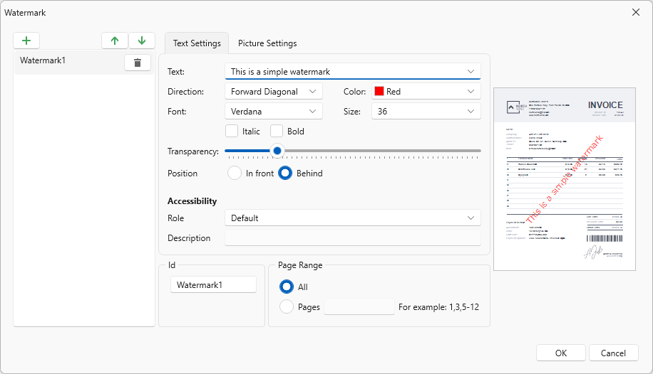

# Changing a Watermark

DevExpress Reporting allows you to display text and picture watermarks on report pages. You can also specify an expression that assigns different watermarks to pages.

This tutorial includes information about the following tasks:

* How to add watermarks.

* How to specify watermark settings.

* How to define watermark accessibility settings.

To invoke the **Watermark** dialog, click the **Watermark**  button on the toolbar.

## Add a Text Watermark

To add a text watermark, open the **Text Watermark** tab. 

Specify the following settings:

* Watermark Id

	The unique identifier of a watermark used to specify the watermark in the WatermarkId property (See the Manage Watermark Collection section for details).

* Font Name

	The font of the watermark’s text.

* Size

	The size of the watermark’s text.

* Unit

	Specifies text measurement system.

* Bold

	Formats the watermark’s text as bold.

* Italic

	Formats the watermark’s text as italic.

* Foreground Color

	The foreground color of the watermark’s text.

* Text

	The watermark’s text.

* Text Transparency

	The transparency of the watermark’s text.	

* Text Direction

	The incline of the watermark’s text.	

* Text Position

	Specifies whether a watermark should be printed behind or in front of page content.

* Page Range

	The range of pages which contain a watermark.

* Role

    Specifies the role of a text watermark in the exported PDF document. This value is used by assistive technologies.

* Description

    Specifies the description of a text watermark used by assistive technologies.      

## Add an Image Watermark

To add a picture watermark, switch to the **Picture Watermark** tab. To load the image to be used as a watermark, click the ellipsis button for the **Image** property. In the invoked dialog, select the file containing the image that you wish to load and click **Open**.

Specify the following settings:

* Watermark Id

	The unique identifier of a watermark used to specify the watermark in the WatermarkId property (See the Manage Watermark Collection section for details).

* Image Source

   Specifies the image that you wish to use as a watermark.

* Image Position

	Specifies whether a watermark should be printed behind or in front of page content.

* Image Transparency

	The transparency of the watermark’s image. The **Transparency** property is unavailable when you specify an SVG image.   

* Image View Mode

	The mode in which a picture watermark is displayed.

* Image Tiling

	Specifies whether a picture watermark should be tiled.

* Image Alignment

	Specifies the horizontal or vertical alignment of the watermark.

* Page Range

	The range of pages which contain a watermark.

* Role

    Specifies the role of an image watermark in the exported PDF document. This value is used by assistive technologies.

* Description

    Specifies the description of an image watermark used by assistive technologies.   

### Supported Image Formats

A picture watermark supports the following formats:

* BMP
* JPG / JPEG / JPE / JFIF
* GIF
* TIF / TIFF
* PNG
* ICO
* DIB
* RLE
* EMF / WMF
* SVG     

## Combine Text and a Picture in One Watermark

You can display both text and a picture in one Watermark. Use the **Text Position** and **Image Position** options of the watermark to specify whether the text and picture should be displayed behind or in front of page content.

For example, create a watermark and specify its text and picture settings. Set position of the text to **InFront** and position of the picture to **Behind**:

As a result, the image is displayed behind the table, while the text is in front of the content:

## Watermark Accessibility Settings

Use the following options to specify whether to include report watermarks in the logical structure of exported PDF documents:

* For image watermarks that convey meaningful information, set the **Role** property to **Figure** and use the **Description** property to specify alternative text.

* For text watermarks, set the **Role** property to **Paragraph** and use the **Description** property to specify alternative text.

For purely decorative watermarks, retain the default value to treat the watermark as an artifact.

## Remove a Watermark

To remove watermarks from a document, click the watermarks's "bin" icon in the **Watermark** dialog. Then, click **OK** to save changes and close the dialog. 

