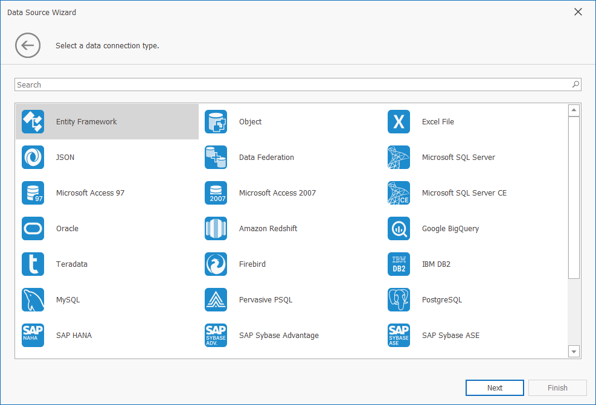
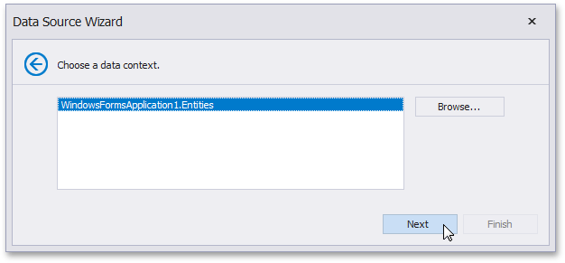
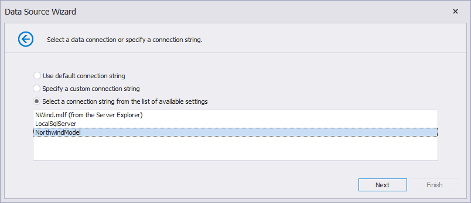

---
title: Bind a Report to an Entity Framework Data Source
---
# Bind a Report to an Entity Framework Data Source

This document describes how to use an Entity Framework data source to bind a report to data provided by an Entity Framework data context:
## Create a Report

[Create a new report](../add-new-reports.md).

## Select a Data Source and Specify Data Context

Click the report's smart tag. In the invoked actions list, expand the drop-down menu for the **Data Source** property and click **Add New DataSource**.
	

On the first page of the invoked [Data Source Wizard](../report-designer-tools/data-source-wizard.md), select the **Entity Framework** and click **Next**.
	

On the next page, select the required data context. You can bind it to an Entity Framework data context that is contained in either the current project assembly or a separate assembly.
	
To use a data context that exists in the current project assembly, select it in the **Choose Context** list and click **Next**.
	

	
## Select a Connection String

On the next page, specify a connection string used to establish a data connection. The following options are available:
### Default Connection String

Choose the default connection string if it is specified in the application’s configuration file.

### Custom Connection String

Specify a custom connection string in the connection string editor and choose whether or not to store the string in the application’s configuration file.

 

### Predefined Connection String

Select an existing connection string available in the current project. 

## Add Stored Procedures (Optionally)

The next wizard page is available only if the current entity data model contains stored procedures. This page allows you to add stored procedures to the data source and configure their parameters. Click **Finish** to exit the wizard.
	

## Apply Filter Criteria

On the last page, you can apply filter criteria to the resulting query. Click Finish to create the data source.

## Result
	
The newly created data source will be displayed in the **Data Sources** node of the [Report Explorer](../report-designer-tools/ui-panels/report-explorer.md). Additionally, the hierarchy of the data source will be reflected by the [Field List](../report-designer-tools/ui-panels/field-list.md).
	
