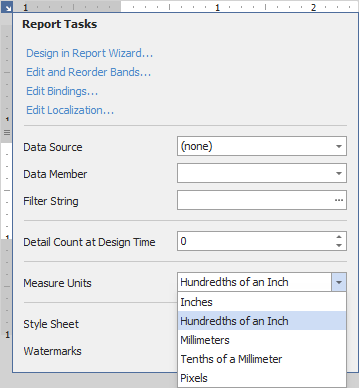
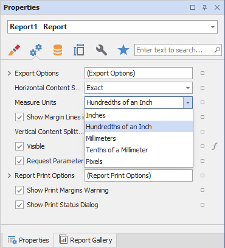

---
title: Change a Report's Measurement Units
author: Natalia Kazakova
---
# Change a Report's Measurement Units

Most metrics of report elements (i.e., element locations, dimensions and margins) can be expressed in units that correspond to one of the following systems of measurement.

* **Imperial system**: hundredths of an inch, inches.
	
	This is the default system that is assigned to each new report.
* **Metric system**: tenths of a millimeter, millimeters.
* **Screen coordinates**: pixels.

To assign a system of measurements to a report, use its **Measure Units** property. You can specify this property in the report's smart tag:

Alternatively, you can enable this property in the [Property Grid](../report-designer-tools/ui-panels/property-grid-tabbed-view.md)'s **Behavior** tab:

> [!Note]
> Changing the system of measurement results in converting the corresponding property values and updating the layout of all report elements in the Report Designer. Notably, the system of measurement determines the minimum increment with which an element's [location and size](../use-report-elements/manipulate-report-elements/arrange-report-controls.md) can be changed.

You can control whether to display exact element size while resizing. For this, toggle the **Dimension Notation** option in the View tab:

The notation are based on a selected report unit:

| System of Measurement | Displayed Unit | Image |
| --- | --- | --- |
| Imperial system     | inches |      |
| Metric system     | millimeters |      |
| Screen coordinates | pixels | |