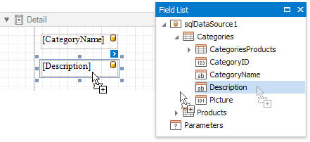
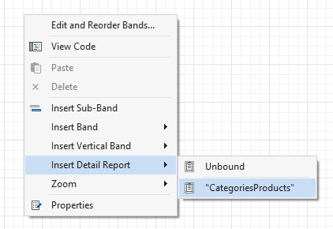
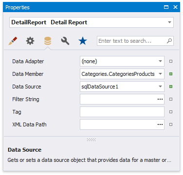
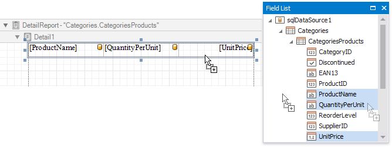
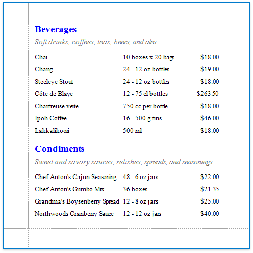

# Master-Detail Reports with Detail Report Bands

This tutorial shows how to display hierarchical data in a master-detail report with nested [Detail Report bands](../introduction-to-banded-reports.md). Use this approach when the data source contains a master-detail relationship. Another approach is described in [Master-Detail Reports with Subreports](master-detail-reports-with-subreports.md).

1. [Create a new report](../add-new-reports.md) or [open an existing one](../open-reports.md).

2. [Bind the report](../bind-to-data.md) to a required data source and provide it with a master-detail relationship as described in the [Bind a Report to a Database](../bind-to-data/bind-a-report-to-a-database.md) topic.

3. Drop the required data fields from the [Field List](../report-designer-tools/ui-panels/field-list.md) onto the [Detail](../introduction-to-banded-reports.md) band.

    

4. Create a [Detail Report Band](../introduction-to-banded-reports.md) by right-clicking the report's surface. In the context menu, select **Insert Detail Report**, and then select the name of the master-detail relationship.

    

    This sets the detail report's **Data Source** and **Data Member** properties automatically.

    

5. Switch to the **Field List**, select the data fields while holding CTRL or SHIFT, and drag them to the Detail band.

    

    Drag fields from the data category that matches the current detail level (the table specified in the most inner report’s DataMember). This ensures that each detail record is displayed correctly.

    You can display parent values in a detail row using expressions (for example, [Categories.CategoryName]). If a field is not found at the current level, the expression engine automatically resolves it from the parent level.

    However:

    - If multiple levels contain the same field path, the result may be ambiguous and a value from an unexpected level can be used.
    - If you use a field from another table within the same data source, the first record from that table will be shown for all rows.
    - If you use a field from a different data source, no data will be displayed.

6. If required, customize the report's [appearance](../customize-appearance.md) and [format values](../shape-report-data/format-data.md).

Switch to [Print Preview](../preview-print-and-export-reports.md) to see the resulting report.

