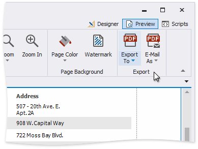
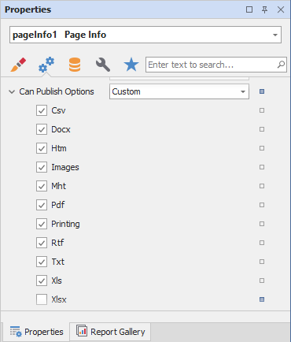
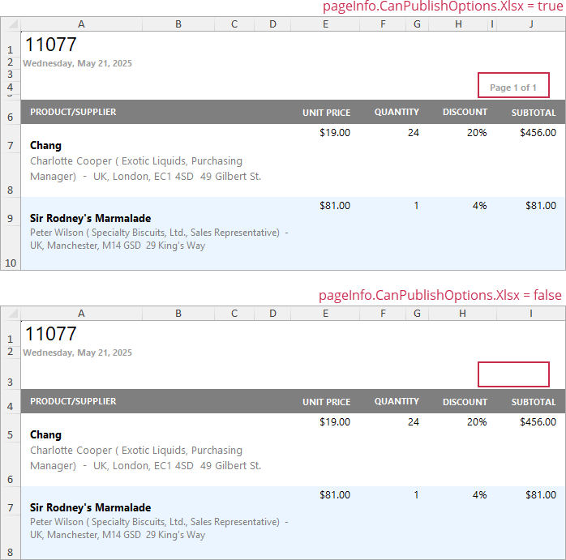
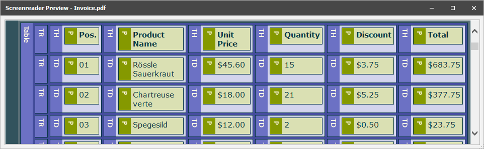
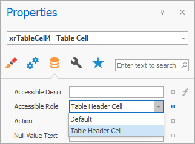
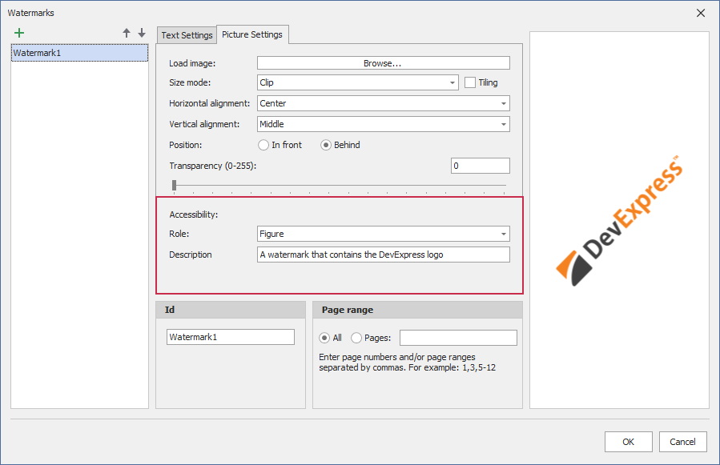
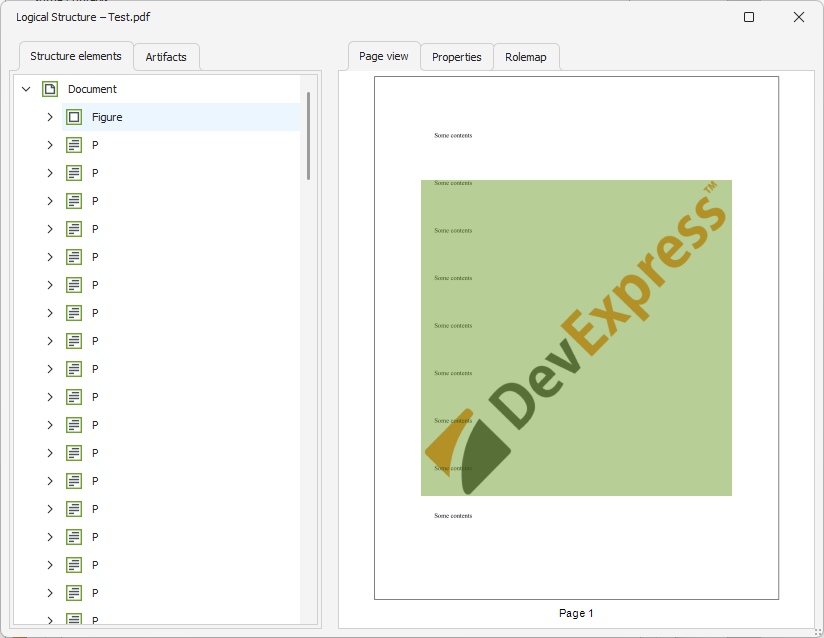
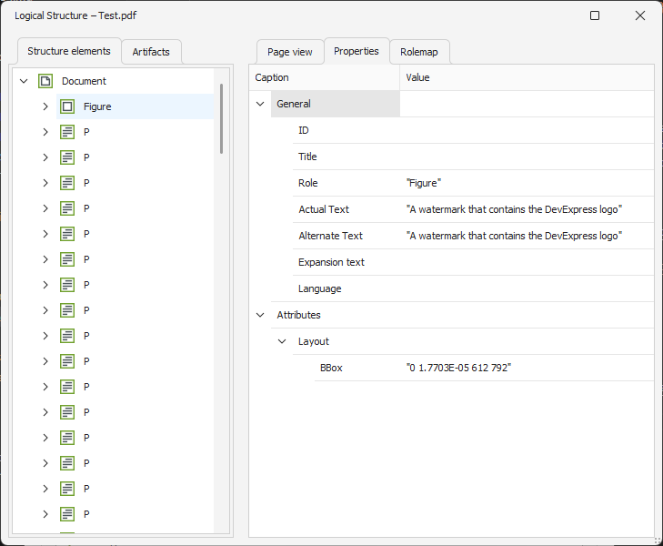
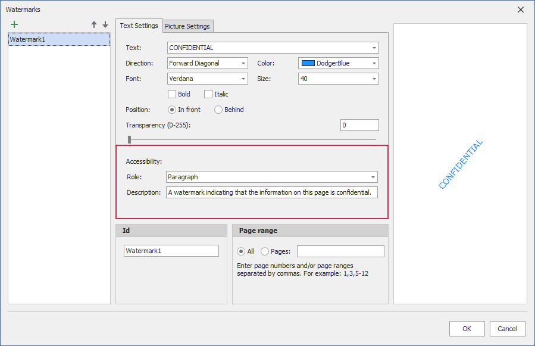
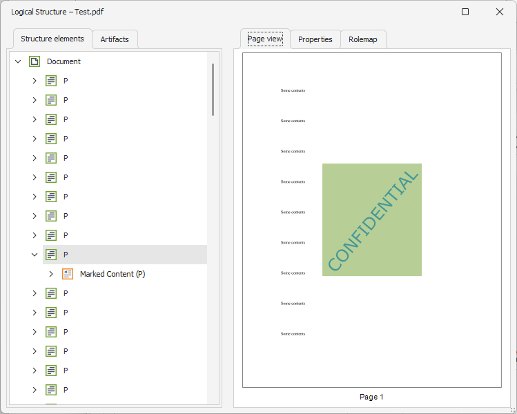

---
title: Preview, Print and Export Reports
---
# Preview, Print and Export Reports

## Preview a Report
To switch a report to the print preview mode, click the **Preview** tab. You will see your report populated with data and broken down into pages, as specified.

> [!NOTE]
> To learn more about the options available in the print preview mode, refer to the [Print Preview for WinForms](../../print-preview/print-preview-for-winforms.md) section of this documentation.

## Print a Report

When in the Print Preview mode, you can print out your report using the appropriate menu and toolbar commands.

## Export a Report

When in the Print Preview mode, you can export your report to files in different formats. The resulting files can either be saved to the hard drive or sent by e-mail.

The following documents describe the basics of report exporting and format-specific export options.
* [Exporting from Print Preview](../../print-preview/print-preview-for-winforms/exporting/exporting-from-print-preview.md)
* [PDF-Specific Export Options](../../print-preview/print-preview-for-winforms/exporting/pdf-specific-export-options.md)
* [HTML-Specific Export Options](../../print-preview/print-preview-for-winforms/exporting/html-specific-export-options.md)
* [MHT-Specific Export Options](../../print-preview/print-preview-for-winforms/exporting/mht-specific-export-options.md)
* [RTF-Specific Export Options](../../print-preview/print-preview-for-winforms/exporting/rtf-specific-export-options.md)
* [XLS-Specific Export Options](../../print-preview/print-preview-for-winforms/exporting/xls-specific-export-options.md)
* [XLSX-Specific Export Options](../../print-preview/print-preview-for-winforms/exporting/xlsx-specific-export-options.md)
* [CSV-Specific Export Options](../../print-preview/print-preview-for-winforms/exporting/csv-specific-export-options.md)
* [TXT-Specific Export Options](../../print-preview/print-preview-for-winforms/exporting/txt-specific-export-options.md)
* [Image-Specific Export Options](../../print-preview/print-preview-for-winforms/exporting/image-specific-export-options.md)

## Hide Report Controls in Documents Exported to Specific Formats

You can specify the **Can Publish Options** setting in the Properties grid to exclude report controls from certain export formats.

The following image illustrates the resulting XLXS document with and without page information:

## Export a Report to PDF with Accessible Tags (PDF/UA Compatibility)

Use the **Accessible Role** option to specify how report elements should be treated by screen readers in the exported PDF document. Set the **PDF/UA Compatibility** property to **PDF/UA-1** to conform the exported PDF document to PDF/UA specification. Then, export the report to PDF format.

Use this table to map report controls to accessibility structure roles in exported PDF files. 

The table describes the following:

- How each control behaves when the **Accessible Role** property is set to **Default**.
- Roles you can assign to ensure that screen readers correctly identify the element's purpose in the exported PDF document.

> [!Tip]
> **Decorative** role means an element is treated as an artifact (outside the tag tree). Use this role only for non-informative visual elements. 

| Element(s) | Default behavior when **Accessible Role** = **Default** | Role you can specify | 
|---|---|---|
| `Label` | No semantic role; treated as a `Div`. | Heading | 
| `Table` | No semantic role; treated as a `Div`. | Table | 
| `Table Row` | No semantic role; treated as a `Div`. | Table Header Row | 
| `Table Cell` | Treated as a paragraph (`P`). | Header Cell | 
| `Watermark` (an image watermark) | Treated as an artifact; excluded from the PDF logical structure. | Figure | 
| `Watermark` (a text watermark) | Treated as an artifact; excluded from the PDF logical structure. | Paragraph |
| `Picture Box`, `Shape`, `Bar Code`, `Zip Code` | Treated as a `Figure`. | Decorative (Artifact) | 

The **Accessible Description** property is not in effect for artifacts.

### Define Label Accessible Role

Set the control’s **Accessible Role** property to **Heading 1 - Heading 6** before you export a report.

In the PDF Export Options dialog, set the **PDF/UA Compatibility** property to **PDF/UA1** to conform the exported PDF document to PDF/UA specification. Then, export the report to PDF format.

The image below shows the result. **Accessible Role** is set to **Heading 2**, and the screen reader treats **Label** as a “level two” heading in the exported document:

### Define Table Accessible Role

You can specify how Table should be treated by screen readers in the exported PDF document. For this, set the control's **Accessible Role** property to **Table** before you export a report.

In the PDF Export Options dialog, set the **PDF/UA Compatibility** property to **PDF/UA1** to conform the exported PDF document to PDF/UA specification. Then, export the report to PDF format.

The image below shows the result. **Accessible Role** is set to **Table**, and the screen reader treats Table as a table in the exported document:

### Define Table Row Accessible Role

You can specify how Table Row should be treated by screen readers in the exported PDF document. 

Before you export a report, set the **Table**'s **Accessible Role** property to **Table** to define a control as a table. Then, specify **Table Row**'s **Accessible Role**:

In the PDF Export Options dialog, set the **PDF/UA Compatibility** property to **PDF/UA1** to conform the exported PDF document to PDF/UA specification. Then, export the report to PDF format.

The image below shows the result. **Table Row**'s **Accessible Role** is set to **Table Header Row**, and the screen reader treats **Table Row** as a header row of the table in the exported document:

 

### Define Table Cell Accessible Role

Before you export a report, set the **Table**'s **Accessible Role** property to **Table** to define a control as a table. Then, specify the **Table Cell**'s **Accessible Role** property:

> [!NOTE]
> **Accessible Role** is not in effect for cells merged with the Cell's **Row Span** property. 

In the PDF Export Options dialog, set the **PDF/UA Compatibility** property to **PDF/UA1** to conform the exported PDF document to PDF/UA specification. Then, export the report to PDF format.

The image below shows the result. **Table Cell**'s b is set to **Table Header Cell**, and the screen reader treats Table Cell with "Bill to:" text as a header cell in the exported document:

### Define Watermark Accessible Role

#### Image Watermark

Use the **Role** property to specify how screen readers interpret image watermarks in exported PDF documents. You can change the value to **Figure** or keep the default value of **Artifact**. An artifact does not appear in the tag tree and is considered external to the content. The **Description** property is not in effect for artifacts.

If an image watermark conveys meaning and you want to include it to PDF document logical structure, set **Role** to **Figure** when you create or edit the watermark:

Before you export your report, set the **PDF/UA Compatibility** property to **PDF/UA1** to make the document PDF/UA compatible.

The image below shows the result. **Role** is set to **Figure**, and the screen reader treats watermark as a figure in the exported document:

Use the **Description** property to specify the description of the resulting element:

#### Text Watermark

Use the **Role** property to specify how screen readers interpret text watermarks in exported PDF documents. You can change the value to **Paragraph** or keep the default value of **Artifact**. An artifact does not appear in the tag tree and is considered external to the content. The **Description** property is not in effect for artifacts.

If a text watermark conveys meaning and you want to include it to PDF document logical structure, set **Role** to **Paragraph** when you create or edit the watermark:

Before you export your report, set the **PDF/UA Compatibility** property to **PDF/UA1** to make the document PDF/UA compatible.

The image below shows the result. **Role** is set to **Paragraph**, and the screen reader treats watermark as a paragraph in the exported document:

Use the **Description** property to specify the description of the resulting element:

### Hide Elements from the Logical Tree 

Use the **Accessible Role** property to specify how screen readers treat the **Picture Box**, **Shape**, **Bar Code**, and **Zip Code** controls in exported PDF documents. You can change the value to **Decorative** or keep the default value of **Figure**.

A decorative element is called an artifact and is not part of PDF document logical structure. An artifact does not appear in the tag tree and is considered external to the content.

> [!NOTE]
> Do not exclude elements that carry meaning, use this tag only for decorative elements.

