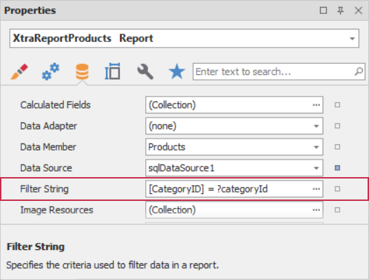

# Create Drill-Through Reports

Follow this tutorial to create a _drill-through report_ (a user can click a Category entry to invoke a detail report with Products). This report type keeps the original report compact while still allowing access to more detailed information. 

The tutorial involves two main steps:

- Add a master-detail relationship between "Categories" and "Products" reports within one project. 
- Use detail report parameters to filter records based on the selected category.

## Add a Master-Detail Relationship between Reports

Define a master-detail relationship between _Category_ and _Product_ reports within a single project:

- Select the XRControl's element (**Table Cell** in this example) in the main report.
- Set its **Action** property to **NavigateToReportAction**.
- Assign the **ReportSource** property to a detail report instance.

If you switch to **Preview**, you can click on a _Category_ value in the table. The **Preview** window navigates to the detail report that contains all _Product_ entries. The next step explains how to filter this list. 

A Breadcrumb control automatically appears below the Document Viewer toolbar and allows you to navigate back to the original report.

## Specify Parameter Binding to Display Required Data

You can specify parameters during detail report navigation. Use the **Parameter Bindings** property to limit displayed records (such as products) to a selected category.

To invoke the **Parameter Binding Collection Editor**, click the ellipsis button in the **Parameter Bindings** property. Within this editor, click the **Sync** button to automatically obtain detail report parameters and set **Binding** to the data field or parameter of the original report.

Set **Binding** to the _CategoryID_ field.

Set the following filter string in the detail report to display product records for the selected category.

## Result

Switch to **Preview** and click on a category entry in the master report. The **Preview** navigates to the detail report that displays only products related to the selected category.

