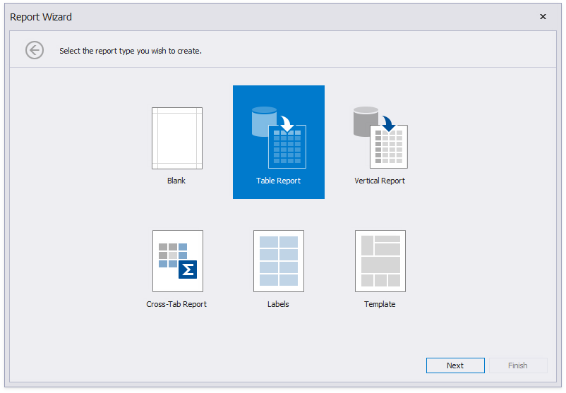
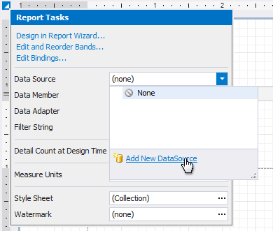

# Data Source Wizard

The Data Source Wizard enables you to configure a data source and retrieve the required data. 

The wizard supports the following data source types:

* [Database](data-source-wizard/connect-to-a-database.md)
	
	Obtains data from all major data providers (Microsoft SQL Server, XML data, Microsoft Access, Oracle, etc.).
* [Entity Framework](data-source-wizard/connect-to-an-entity-framework-data-source.md)
	
	Supports binding to a Microsoft ADO.NET Entity Framework data source.
* [Object Binding](data-source-wizard/connect-to-an-object-data-source.md)
	
	Connects to a data object.
* [Excel File](data-source-wizard/connect-to-an-excel-data-source.md)
	
	Obtains data from Microsoft Excel workbooks (XLS, XLSX or XLSM files) or CSV files.
* [JSON](data-source-wizard/connect-to-a-json-data-source.md)

	Connects to JSON-formatted data.

* [MongoDB](data-source-wizard/connect-to-a-mongo-db.md)

	Connects to a MongoDB instance.

* [XPO](data-source-wizard/connect-to-an-xpo-data-source.md)

	Allows you to bind to **XPO** data.

* [No Data](data-source-wizard/no-data.md)

	Allows you design a report that is not bound to a data source.	

The Data Source Wizard allows you to do the following:

* [Add a new data-bound report](../add-new-reports.md) to your application using the [Report Wizard](report-wizard.md), which contains the Data Source Wizard pages.
	
	

* Bind an existing report or its [Detail Report band](../introduction-to-banded-reports.md) to data. To invoke this Wizard, click **Add Data Source** on the [Ribbon](ui-panels/toolbar.md)'s **Home** page.

    
	
    Alternatively, click the report's smart tag, expand the **DataSource** property's drop-down menu and click **Add Report Data Source**.

	
	
* Connect the [Chart](../use-report-elements/use-charts-and-pivot-grids.md), [Cross Tab](../use-report-elements/use-cross-tabs.md) and [Sparkline](../use-report-elements/use-gauges-and-sparklines.md) report controls to individual data sources.

    You can invoke the Data Source Wizard using the **Add Data Source** command on the **Chart** | **Design** contextual page.

    

    You can invoke the Data Source Wizard using the **DataSource** property in the chart's smart tag.
	
	