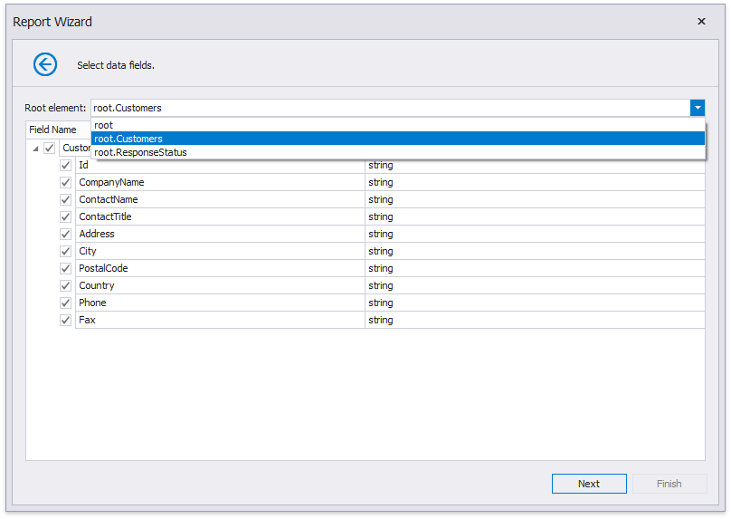
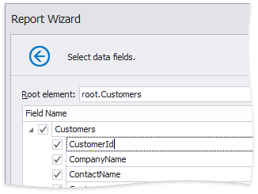

# Select Data Fields

On this page, the wizard shows the specified JSON data's structure. You can choose all nodes or a subset of nodes.

Uncheck the data fields that your report does not require.

You can rename data fields if necessary.

