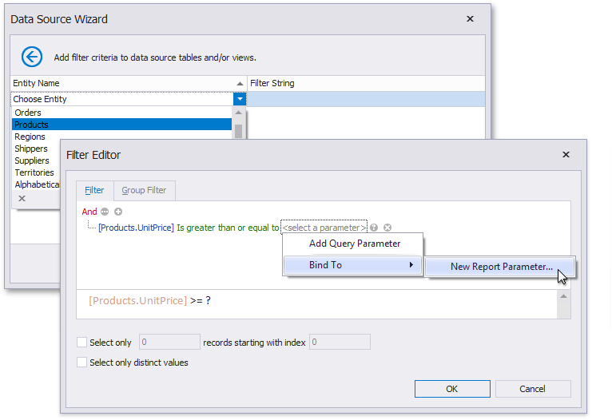

# Configure Filters

This wizard page allows you to define any number of [filter criteria param($match) $path = $match.Groups[1].Value; if ($path -notmatch '^https?://' -and $path -notmatch '^~/' -and $path -notmatch '^\.\./\.\./') { '](' + '../' + $path + '.md)' } else { $match.Value }  for your data source.

The **Filter Editor** is displayed after choosing an entity on this wizard page.

Use this editor to define the selected entity's filter criteria. The filter string can also reference [report parameters param($match) $path = $match.Groups[1].Value; if ($path -notmatch '^https?://' -and $path -notmatch '^~/' -and $path -notmatch '^\.\./\.\./') { '](' + '../' + $path + '.md)' } else { $match.Value } .

