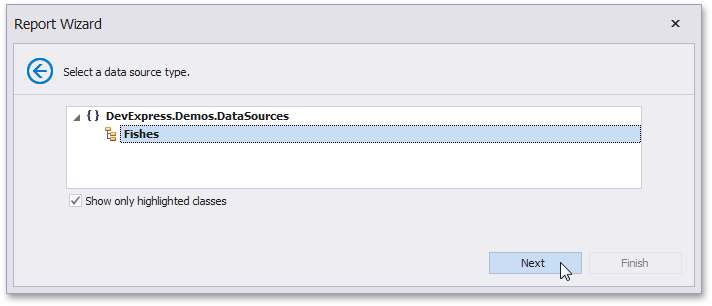

# Select a Data Source Type

On this wizard page, select a required data source type. To exclude irrelevant classes from the list, select the **Show only highlighted classes** check box.

Click **Next** to proceed to the next wizard page: [Select a Data Source Member param($match) $path = $match.Groups[1].Value; if ($path -notmatch '^https?://' -and $path -notmatch '^~/' -and $path -notmatch '^\.\./\.\./') { '](' + '../' + $path + '.md)' } else { $match.Value } .