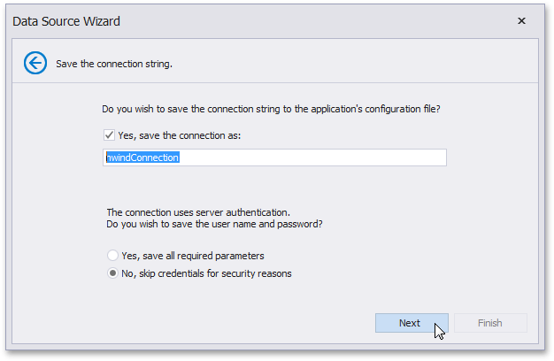

# Save the Connection String

On this page, select whether or not to save the created connection string to the application's configuration file.

If the data connection uses server authentication, you can also choose to save the user credentials along with the connection string.

