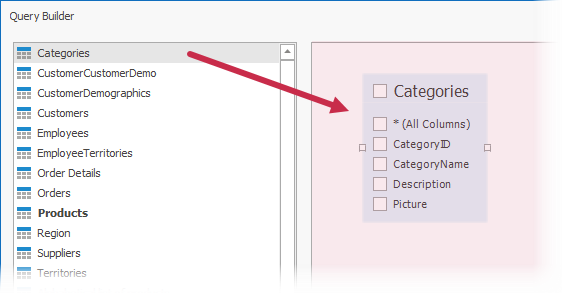
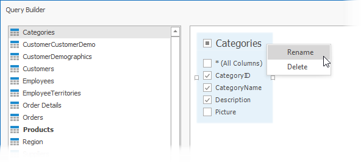
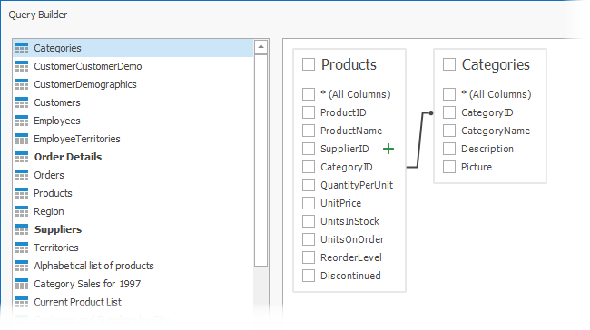
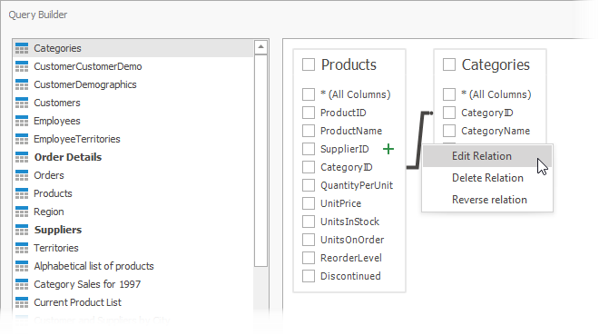
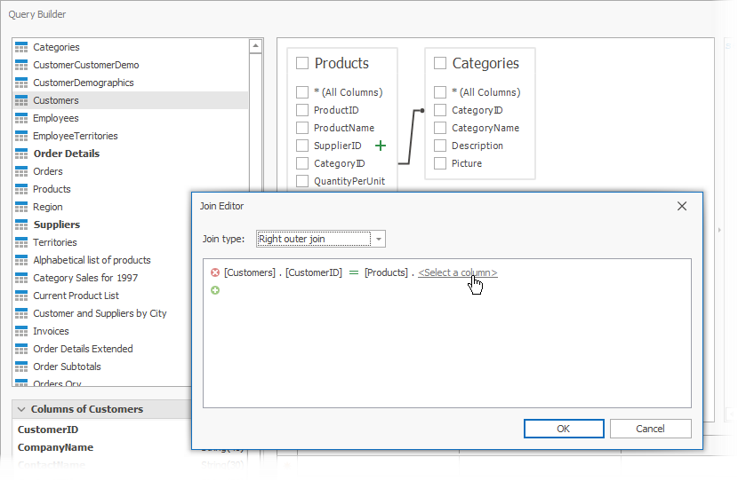
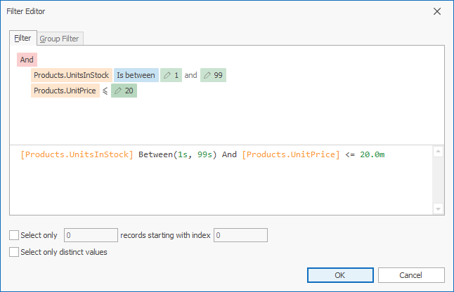
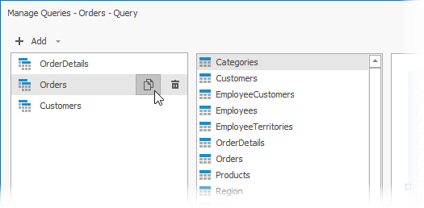

---
title: Query Builder
---

# SQL Query Builder (WinForms)

The **Query Builder** allows you to construct SQL queries to retrieve data from an [SQL Database](../bind-to-data/bind-a-report-to-a-database.md).

## Run the Query Builder

Use the [Data Source Wizard](data-source-wizard.md) or [Report Wizard](report-wizard.md) to bind your report to an [SQL Database](../bind-to-data/bind-a-report-to-a-database.md). Switch to the [query customization page](data-source-wizard/connect-to-a-database/create-a-query-or-select-a-stored-procedure.md) and click the *Add* button in the **Queries** row.

## Select Tables

Drag the table that you want to add to a query from the list of available tables and drop the table onto the **Query Builder** surface.

To find a table by name, switch to the table list, press *CTRL+F*, and enter the table name in the editor.

Enable checkboxes for the table columns that you want to include in the query.

If you want to include all the columns available in the table, enable **\* (All Columns)**.

Right-click the table and select *Rename* or *Delete* to change the table's name or remove it.

## Join Tables

You can join multiple tables within the same query. Do one of the following to add a table onto the **Query Builder** surface:

- Drag and drop a table from the table list onto the surface. 
- Double-click a table in the table list.

The table list on the left highlights all child and parent tables that are bound to the dropped table by a foreign key. 

Add required tables to the surface. The *Inner Join* relation with the previously added table is created automatically. Added tables display the green plus button for the columns that refer to other tables. You can click this icon to add a linked table to the query and create the *Inner Join* relation with this table.

Right-click a relation to edit, delete, or reverse.

The *Edit Relation* command invokes the **Join Editor**. It allows you to specify the join type (*Inner*, *Left Outer*, *Right Outer*, or *Full Outer* ), columns by which the tables should be joined, and a logical operator (*Equal to*, *Is less than*, or others) used to compare table columns.

You can manually join tables if they are not bound by a foreign key at the database level. In this case, when you drag-and-drop a table onto the **Query Builder** surface, the **Join Editor** is automatically invoked, and this editor allows you to construct a custom join relation.

> [!NOTE]
> When you join multiple tables within a single SQL query, you create a flattened table composed of data records selected based on the specified join relations. You can also create [hierarchical data sources](data-source-wizard/connect-to-a-database/create-a-query-or-select-a-stored-procedure.md). In general, [master-detail reports](../create-reports/master-detail-reports-with-detail-report-bands.md) are generated faster than similar-looking reports created based on flattened data sources. If possible, use hierarchical data sources instead of flattened ones.

## Shape Data

The **Query Builder** displays a list of the query's columns at the bottom-right corner.

This list allows you to add new table columns to the query or shape selected table columns. The following options are available:

* **Column** - Specifies the selected column. Click the down-arrow button to display a drop-down column list and replace the column with another column. Click the ellipsis button to replace the column with an [expression](../use-expressions.md).

    

* **Table** - The table that contains the selected column. When you create an expression for a column, this option displays **(All Tables)**.

* **Alias** - A custom column name.

* **Output** - Specifies whether to include the column in the query's resulting set.

* **Sorting Type** - Specifies whether to keep the initial data record order (**Unsorted**) or sort the records by the column (**Ascending** or **Descending**).
	
	> [!NOTE]
	> When you bind a report to an XML file, the **Query Builder** does not support sorting by aggregate functions and the *DISTINCT* and *SELECT ALL* statements.

* Sort Order - Defines the sort order when data is sorted by multiple columns. For example, if column **A** has the sort order set to **1** and column **B** has it set to **2**, data records are first sorted by column **A** and then by column **B**. This option is available if you enable the **Sorting Type** option.

* **Group By** - Specifies whether to group the query's resulting set by this column.

* **Aggregate** - Specifies whether to apply an aggregate function to column values. The following aggregate functions are supported:
	
	* Count
	* Max
	* Min
	* Avg
	* Sum
	* CountDistinct
	* AvgDistinct
	* SumDistinct

When you want to use the **Group By** or **Aggregate** operations, you should apply them either to all columns or none of them. When you use these operations, only the result of aggregation or grouping is included in the result set.

## Filter Data

Click the **Filter** button to invoke the **Filter Editor**.

The editor has the following tabs:

* **Filter Tab** - Allows you to build criteria to filter data for the report. Filter criteria can reference [query parameters](../bind-to-data/specify-query-parameters.md), which you can also map to [report parameters](../use-report-parameters.md).
* **Group Filter Tab** - Allows you to specify filter conditions for grouped and aggregated data. This tab is disabled if the data is not grouped.

You can also enable the **Select only** option to limit the number of resulting data records. If you enable the **Sorting Type** option for at least one column, you can specify how many data records should be skipped.

> [!NOTE]
> Some data providers do not support the skip setting in the provider-specific SQL string. If you enable the **Select only** option for such data providers, data records are skipped but the *SKIP* statement is not included in the SQL query.

The **Select only distinct values** option allows you to include only unique values into the resulting set.

## Edit Query Parameters

Click **Edit Parameters** to invoke the **Query Parameters** dialog.

This dialog allows you to add, edit, and remove [query parameters](../bind-to-data/specify-query-parameters.md). The created parameters are available on the [Configure Query Parameters](data-source-wizard/connect-to-a-database/configure-query-parameters.md) wizard page.

The following properties are available for each query parameter:

* **Name** - The name by which you can reference the parameter.

* **Type** - The data type of the parameter's value.

* **Expression** - Specifies whether the parameter's value is static or generated dynamically. You can enable this option when you need to map the parameter's value to a [report parameter](../use-report-parameters.md)'s value.

* **Value** - The parameter's value. If the **Expression** option is enabled, this value is generated dynamically based on the parameter's [expression](../use-expressions.md).

Refer to the following topic for more information: [Specify Query Parameters](../bind-to-data/specify-query-parameters.md).

## Preview Results

Click the **Preview Results** button to open the **Data Preview** dialog.

The dialog displays the first 1000 rows of the query result set.

## Manage Queries

Right-click a data source in the [Report Explorer](ui-panels/report-explorer.md) or [Field List](ui-panels/field-list.md) and select **Manage Queries** in the context menu.

This invokes the **Manage Queries** dialog that allows you to perform operations on queries and stored procedures.

### Add a New Query

Click **Add**, specify a name for the new query, and [select tables](#select-tables) that you want to include in the query.

### Copy and Remove Queries

Select a query and click the *Copy* or *Remove* icon.

### Modify Stored Procedures

Select an existing stored procedure and choose a new one that you want to include in a query.

### Add a New Stored Procedure

Expand the **Add** menu and select **Stored Procedure**.

### Rename a Query or Stored Procedure

Double-click an item in the list of queries and stored procedures and use the editor to specify a new name for this item.

