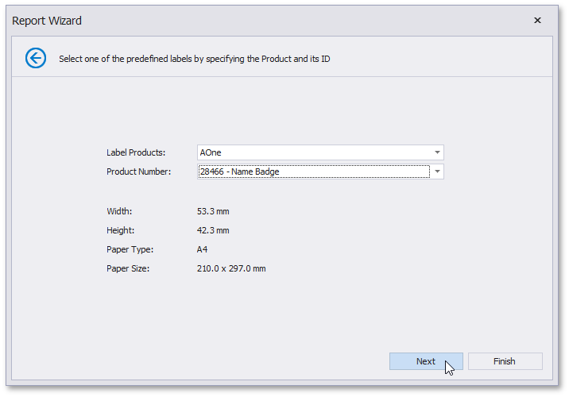

# Select the Label Type

This page is intended to select a label type from numerous predefined types.

On this page you can choose the proper setting from the **Label Products** and the **Product Number** drop-down lists. The selected type defines the label's size and layout, as well as the page type, which is default for this label.

Then, click **Next** to proceed to the [Customize the Label Options param($match) $path = $match.Groups[1].Value; if ($path -notmatch '^https?://' -and $path -notmatch '^~/' -and $path -notmatch '^\.\./\.\./') { '](' + '../' + $path + '.md)' } else { $match.Value }  page.