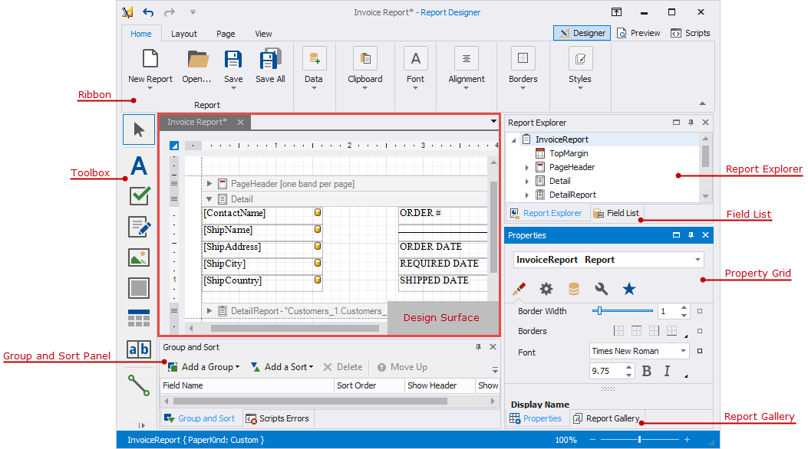

# UI Panels

The Report Designer includes the following panels:

* [Ribbon](ui-panels/toolbar.md)

    Contains the main tabs: Home, Layout, Page, and View, and contextual tabs specific to the currently selected report control. The Ribbon control allows you to switch between Designer and Preview, and open the Scripts editor.
* [Report Explorer](ui-panels/report-explorer.md)

    Displays a tree-like hierarchy of report elements, data sources, and other components, and allows you to manage a collection of visual styles.
* [Field List](ui-panels/field-list.md)

    Displays the data source schema and allows you to manage calculated fields and parameters.
* [Report Gallery](ui-panels/report-gallery.md)

    Allows you to store and reuse report controls, styles, data sources, and entire report layouts.
* [Property Grid](ui-panels/property-grid-tabbed-view.md)

    Allows you to view and modify report settings and report element properties.
* [Group and Sort Panel](ui-panels/group-and-sort-panel.md)

    Allows you to group and sort data in a report.
* [Report Design Analyzer](ui-panels/report-design-analyzer.md)

    Displays errors, warnings, and information messages that help users create or enhance a report layout.
* [Design Surface](../introduction-to-banded-reports.md)

    An area where you can add report controls and edit a report layout.

* [Toolbox](ui-panels/toolbox.md)

    Lists all available report controls. You can drag a control from the toolbox and drop it onto a report design surface.    