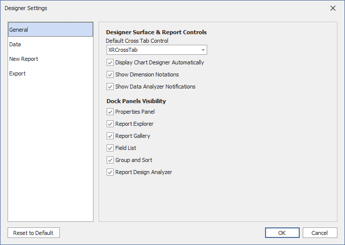
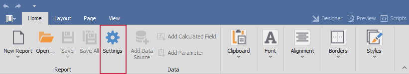
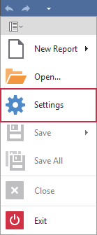

# Designer Settings Dialog

The Designer Settings dialog in the WinForms Report Designer allows users to configure report design and document generation settings globally at the application level. This dialog centralizes frequently used options, streamlines panel management, and simplifies customization of default report behavior.

The dialog groups settings into the following categories:

* General – Report Designer UI and dock panel options.
* Data – application-wide data binding and schema discovery settings.
* New Report – default layout, appearance, and script options for newly created reports. 
* Export – PDF and CSV export behavior.

## Invoke the Dialog

You can invoke the Designer Settings dialog in one of the following ways:

* Click the **Settings** bar item in the Home ribbon tab:

    

* Select the **Settings** option in the application menu:

    

## Dialog UI

The left panel of the dialog contains four categories, each with a set of Report Designer and report settings. 

Specify settings and click **OK** to apply them and close the dialog. Click **Reset to Default** to restore initial values.

The following settings are available:

### General  

This category contains Report Designer UI and dock panel settings.

* Default Cross Tab Control

    Specifies the default control used to present cross-tab data (XRCrossTab or XRPivotGrid).

* Display Chart Designer Automatically

    Specifies whether to invoke the Chart Designer on adding an XRChart to a report.

* Show Dimension Notations

    Specifies whether to display exact element size (dimension notations) on the reporting surface during resize operations. 

* Show Data Analyzer Notification

    Specifies whether to display a notification popup with errors that occurred during report creation.

* Properties Panel

    Specifies whether to display the Properties panel on the Report Designer surface. 

* Report Explorer

    Specifies whether to display the Report Explorer panel on the Report Designer surface. 

* Report Gallery 

    Specifies whether to display the Report Gallery panel on the Report Designer surface.  

* Field List

    Specifies whether to display the Field List panel on the Report Designer surface. 

* Group and Sort 

    Specifies whether to display the Group and Sort panel on the Report Designer surface. 

* Report Designer Analyzer

    Specifies whether to display the Report Designer Analyzer panel on the Report Designer surface. 

### Data 

This category contains application-wide settings related to data binding. 

* Data Binding Mode

   Specifies if the Report Designer binds report controls to data via Expressions (default) or via Data Bindings (legacy option).

* Convert Bindings to Expressions

   Specifies whether end users are prompted to convert direct data bindings to customizable expressions.

* Data Source Request Timeout

   Maximum time the Report Designer waits for an SQL data source response, in seconds.

* Field List Max Search Depth

   Field List search box does not look for fields beyond the specified nesting level.

* MongoDB Schema Discovery Item Count

   Specifies how many documents (records) the Report Designer scans in each collection in order to build the schema.

* JSON Schema Discovery Item Count

   Specifies how many documents (records) the Report Designer scans in each collection in order to build the schema.

* Display Date and Time Components in the Field List

   Specifies whether to expand date-time fields in the Field List panel to reveal their components so you can directly bind them to report controls.

### New Report

This category contains default settings for **all new reports** created in the Report Designer.

* Paper Kind

   Specifies the report size.

* Size 

   Specifies report page height and width measured in report units. You can specify the report size only if Paper Kind is set to `Custom`.

* Margins

   Specifies report page margins, measured in report units.

* Font

   Specifies the default font used in reports.

* Report Unit 

   Specifies the default units of measurement used in reports to define element locations, dimensions, and margins.

* Landscape 

   Specifies whether report page orientation is landscape.

* Snap Mode

   Specifies how report elements snap and align to each other.

* Draw Grid

   Displays or hides the design surface grid.

* Default File Name

   Sets the default file name used when exporting a report from Print Preview.

* Default Export Format

   Sets the default export format in Print Preview.

* Script Language

   Specifies the programming language used in report scripts.  

    > [!Important]
    > This setting is initially hidden. To activate report scripts and display the Script Language setting, script execution must be allowed.

### Export 

This category contains application-wide settings for export to PDF and CSV.

* Use GDI+ Line Break Algorithm

   Uses GDI+ line breaks to optimize text layout in certain languages.

* Follow Report Layout

   Attempts to preserve the report layout. May add extra rows or columns to match element positions.

