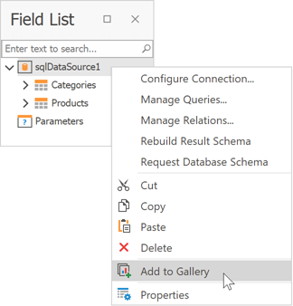
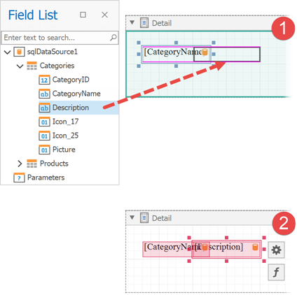
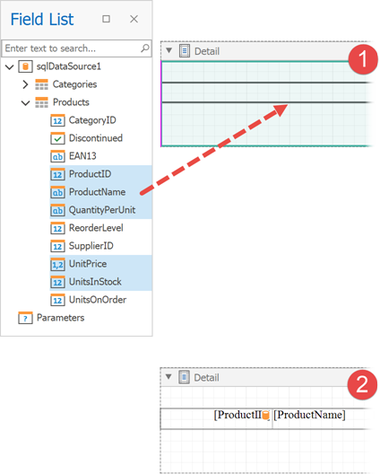
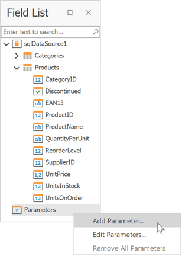

---
title: Field List
owner: Anna Gubareva
seealso: []
---
# Field List

This panel displays the schemas of a report’s data sources.

Right-click a data source to access its settings. For instance, you can add the data source to the [Report Gallery](report-gallery.md) to reuse it in other reports.

The Field List allows you to do the following:

## Search fields

Enter a search string in the search box. The Field List filters fields and tables to match the entered string.

## Bind controls to data

Drop a field onto a report's surface to create a new report control bound to this field.

Drop a field onto an existing report control to bind this control to the field.

Hold the CTRL key when you drop a field on top of an existing control to keep the control's current data binding setting. In this case, a new report control is created.

**Select which control to create**

Do any of the following:

* Hold the SHIFT key when you drop a data field onto the report surface.
* Right-click a data field and drop it onto the report surface.

This invokes a context menu where you can select which control to create.

## Create tables

Drop an entire data table onto the report to create a report table with columns bound to the data table's fields.

Hold the CTRL or SHIFT key to select multiple data fields in the Field List. Drop these fields onto the report to create a report table that only has the selected fields.

Hold the SHIFT key when you drop the selected fields onto the report to only create column headers. This creates a new table whose cells display the selected field names. Alternatively, you can drag and drop fields with the right mouse button.

## Data shaping operations

The Field List can help you do the following:

* Add [calculated fields](../../shape-report-data/use-calculated-fields/calculated-fields-overview.md) to data tables.

	

* Add [report parameters](../../use-report-parameters.md) or change existing parameters.

	
