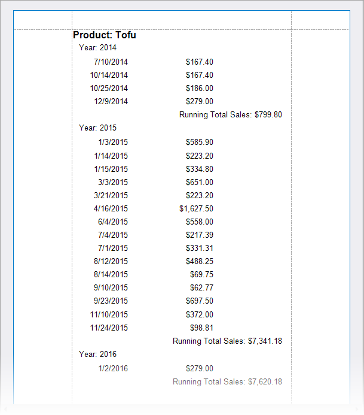
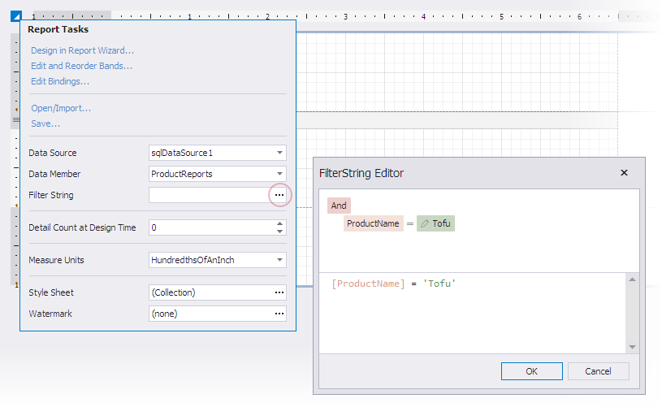
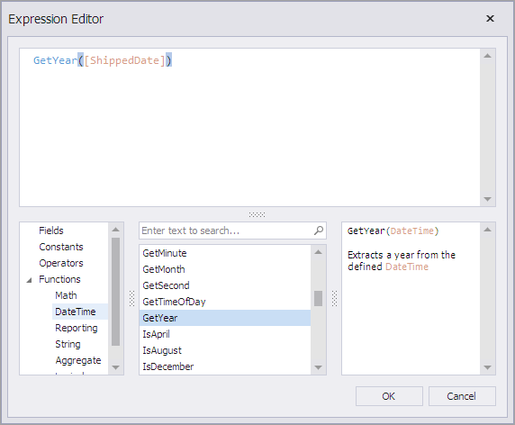
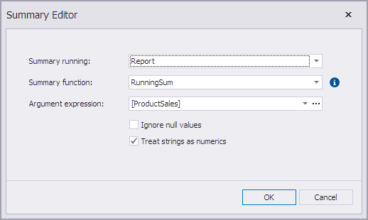

# Calculate a Running Summary

This topic describes how to calculate a running summary across report groups. A running summary adds the current summary value to the previously calculated summaries.

The sample report shows current summaries by year for sales of the specified product:



Follow the steps in the sections below to create a sample report with a running summary.

## Bind a Report to Data

1. [Create a new blank report](../../add-new-reports.md).

1. Click **Add Report Data Source** in the report's smart tag to invoke the **Data Source Wizard**, as illustrated in the following image:

     

1. Create a data source bound to the **ProductReports** view in the sample Northwind database.

1. Filter report data to display only the specified product:

    

    To specify a filter expression, invoke the report's smart tag and click the ellipsis next to the **Filter String** editor. Construct the following criterion in the **FilterString Editor** window:
    ```
    [ProductName] = 'Tofu'
    ```

## Add a Calculated Field to Calculate a Year Value

1. Click _Field List_ in the Visual Studio **XtraReports** menu to invoke the [Field List](../../report-designer-tools/ui-panels/field-list.md) panel. Right-click any field and select **Add Calculated Field**:

    
  
1. Right-click the newly created field and select **Edit Expression** to invoke the **Expression Editor** dialog:

    

1. Enter the following expression that calculates the year value for the `ShippedDate` data field: 
    ```
    GetYear([ShippedDate])
    ```

    

1. In the **Properties** window, rename the calculated field to `calcYear`. Alternatively, right-click the field in the **Field List** and select **Edit Calculated Fields** to invoke the **Calculated Field Collection Editor** where you can specify the field name.

## Group Data by Year
1. Use the [Group and Sort](../group-and-sort-data.md) panel to create a **Group Header** band associated with the `CategoryName` field. If the panel is hidden, click _Group and Sort_ in the **XtraReports** menu:
  
    To create grouping criteria, click **Add a Group** and select the `calcYear` field from the invoked drop-down menu:
  
    

1. Select the **Show Footer** checkbox in the [Group and Sort](../../report-designer-tools/ui-panels/group-and-sort-panel.md) panel to add the **Group Footer** band:

    

## Add Report Controls to Display Data

1. Drop fields from the **Field List** window to report bands to create data-bound [Label](../../use-report-elements/use-basic-report-controls/label.md) controls that display data:

    

1. Use the **Format String** editor in the label's smart tag to specify how to display data.
1. Right-click the report's design area and select **Insert Band - Report Header** to add the Report Header band.
1. Drop the **ProductName** field from the **Field List** window to the **Report Header** band to create a label. Use the label's **Format String** editor to enter a string to display:

    

## Add a Running Summary

1. Drop the **Label** control from the Toolbox to the Group Footer band. Click the ellipsis next to the **Summary** editor in the label's smart tag to invoke the **Summary Editor**: 

    

1. In the **Summary Editor** dialog you should set the following options:

* Summary running

   Specifies the summary calculation range (the entire report, current report group, or current document page). Select _Report_ from the drop-down list.
* Summary function

   Specifies the summary function. When you hover over the information symbol, it shows a tooltip with information about the selected function. Select _RunningSum_ from the drop-down list.
* Argument expression

   Specifies a data field. Select _[Product Sales]_.

    

    Click **OK** to close the dialog window.

1. The Summary Editor settings are automatically converted to an expression that is assigned to the label's **Expression** property:

    

1. You can click the ellipsis next to the Expression editor to invoke the **Expression Editor** dialog:

    

    The dialog allows you to edit the summary expression and change the summary function.

Review the following topic for a list of supported summary functions: [Functions in Expressions](../../use-expressions/functions-in-expressions.md)

1. Switch to the **Preview** tab to see the result.