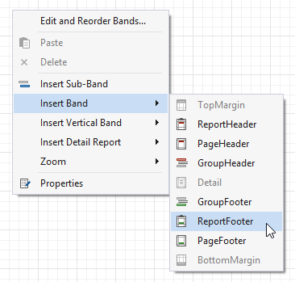
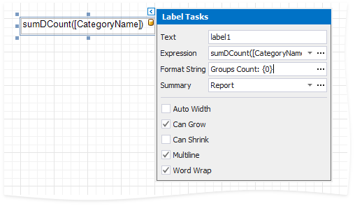

# Count the Number of Groups in a Report

This document describes how to count the number of groups in a report.

1. Switch to the [Group and Sort](../../report-designer-tools/ui-panels/group-and-sort-panel.md) panel and create a new group. Enable the **Show Header** option to display the Group Header in the report.
	
	

2. Switch to the [Field List](../../report-designer-tools/ui-panels/field-list.md) and drop the group field onto the created Group Header.
	
	

3. Right-click the report's surface and add a Report Footer to the report.

	

4. Drop a label onto the Report Footer and click its smart tag. In the invoked **Label Tasks** window, click the **Summary** property's ellipsis button.

	

7. In the Summary Editor window:

	* Set the **Summary running** property to the **Report** value.
	* Set the **Summary function** property to **Count (Distinct)**.
	* Set the **Argument expression** property to the field you group the data by.

8. Back in the **Label Tasks** window, you can use the **Format String** property to format the summary's value:

	

You can see the group count in the report footer when switching to [Print Preview](../../preview-print-and-export-reports.md).

