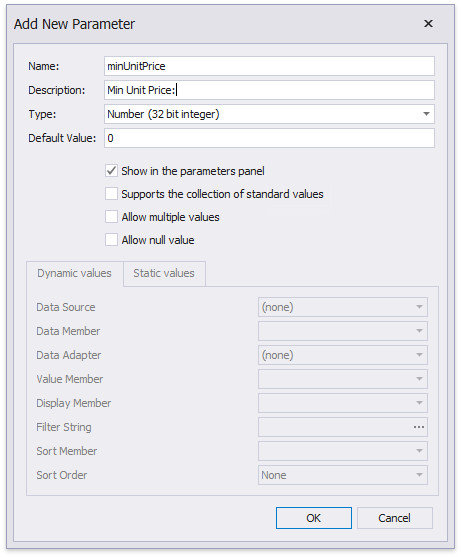
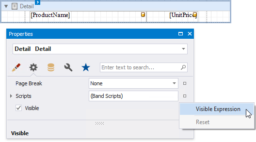

---
title: Conditionally Filter Report Data
author: Anna Gubareva
---
# Conditionally Filter Report Data

This document describes how to filter a report's data based on a specific condition.

1. Switch to the [Field List](../../report-designer-tools/ui-panels/field-list.md), right-click the **Parameters** section and add a new report parameter.
	
	

2. Specify the parameter's description in Print Preview and set its type to **Number (Integer)**.
	
	

3. Select the report's detail band and switch it to the [Property Grid](../../report-designer-tools/ui-panels/property-grid-tabbed-view.md). Navigate to its **Behavior** tab, click the **Visible** property's marker and select **Visible Expression** in the context menu.
	
	

4. In the invoked **Expression Editor**, specify the required visibility condition. For example:
	
	
	
	The expression above enables/disables the **Visible** property depending on whether the field value is below the specified parameter value.

Switch to [Print Preview](../../preview-print-and-export-reports.md) to see the result. 

