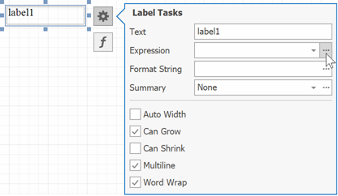
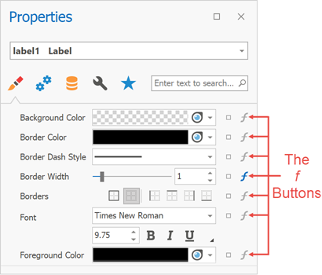
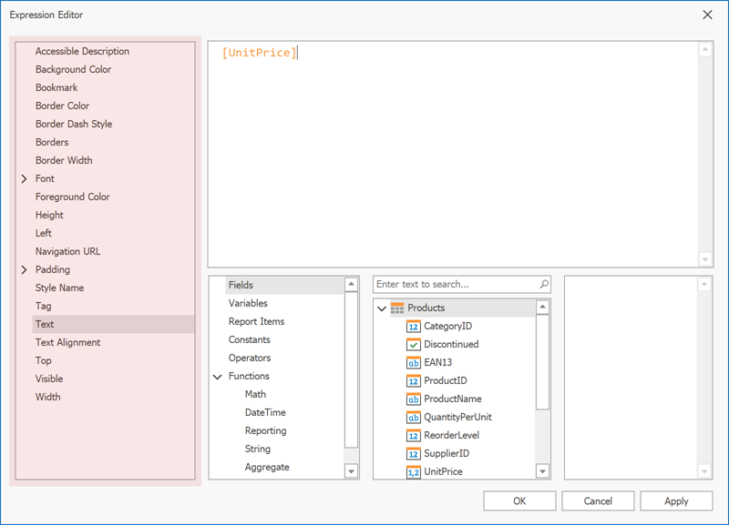
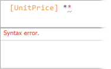
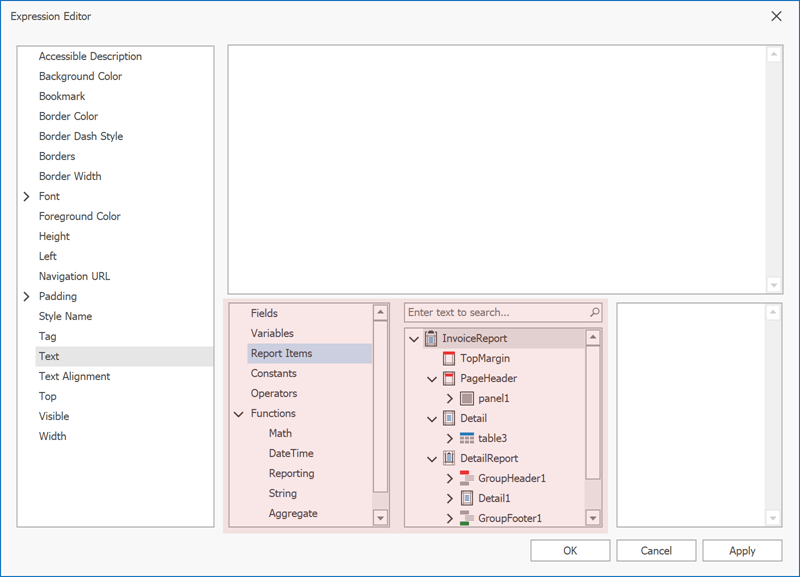

---
title: Expressions Overview
owner: Sergey Andreev
---
# Expressions Overview

Use expressions to accomplish the following tasks:
* [Retrieve data](../use-report-elements/bind-controls-to-data.md)
* [Format data values](../shape-report-data/format-data.md)
* [Create calculated fields](../shape-report-data/use-calculated-fields/calculated-fields-overview.md)
* [Calculate summaries](../shape-report-data/calculate-summaries.md)
* [Specify conditions for report elements](../shape-report-data/specify-conditions-for-report-elements.md)
* [Specify conditions for data source queries](../bind-to-data/specify-query-parameters.md)

## How to Specify an Expression

In the Report Designer, properties that support expressions have an ellipsis button in the value editor. Click this button to invoke the [Expression Editor](#expression-editor).

As an alternative, you can use the [Properties](../report-designer-tools/ui-panels/property-grid-tabbed-view.md) window to set expressions that specify property values. Click the `f` button to specify an expression in the invoked Expression Editor.

In **Expressions Advanced** mode, the Report Designer allows you to specify expressions that are evaluated within specific events:

* The **BeforePrint** event where you can use data fields from all queries in the data source.
* The **PrintOnPage** event fetches the number of pages in the report and the current page. You can use these variables to specify conditions for report items.

See the following topic for more information: [Data Binding Modes](data-binding-modes.md).

## Expression Editor

The Report Designer's Expression Editor has a graphical interface that allows you to create and edit expressions.

Use one of the following ways to invoke the Expression Editor:

* Select a report, band, or control. The `f` button appears next to the selection. Click this button to invoke the Expression Editor.

    

* In the **Properties** window, if an expression can be set for a property, the `f` button appears near the value editor. Click this button to invoke the Expression Editor.

    

    The `f` button changes its color to blue to indicate that an expression is set for a property.

    

The Editor lists all properties for which you can specify an expression.

Click a property to specify an expression.

An `f` icon appears next to a property where an expression is set. Additionally, an asterisk (`*`) appears if an expression is modified.

The Editor highlights an expression's syntax and supports intelligent code completion (which suggests functions and available data elements as you type).

The Expression Editor displays all the errors it finds in the specified expression.

The Editor lists a tree with language elements and items that you can use in an expression.

## FilterString Editor

You can use the Report Designer's **FilterString Editor** to specify the **FilterString** property of a report, [Cross Tab](../use-report-elements/use-cross-tabs.md), or [Chart Series](../use-report-elements/use-charts-and-pivot-grids/add-a-chart-set-up-series-manually.md).

The **FilterString Editor**'s visual interface allows you to use an unlimited number of conditions and combine them with logical operators to create filter criteria. You can also switch to Text mode and type a filter string.

The **FilterString Editor** highlights an expression's syntax and supports intelligent code completion (which suggests functions and available data elements as you type).

## Expression Syntax

An expression can include field names, constants, operators, functions, data fields, and parameters.

See the following topic for more information: [Expression Language](expression-language.md).
