# WinForms End-User Report Designer Keyboard Shortcuts

## Operations with XRControls

### Copy/Paste XRControl

| Key | Action |
|---|---|
| <kbd>Ctrl</kbd> + <kbd>C</kbd> | Copy the selected XRControl. |
| <kbd>Ctrl</kbd> + <kbd>V</kbd> | Paste the copied XRControl. |

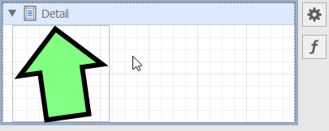

### Cut XRControl

| Key | Action |
|---|---|
| <kbd>Ctrl</kbd> + <kbd>X</kbd> | Cut the selected XRControl. |

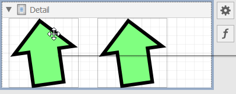

### Delete XRControl

| Key | Action |
|---|---|
| <kbd>Delete</kbd> | Remove the selected XRControl. |

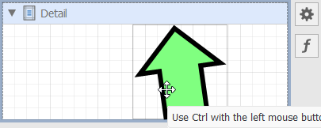

### Undo / Redo an Action

| Key | Action |
|---|---|
| <kbd>Ctrl</kbd> + <kbd>Z</kbd> | Undo the last operation. |
| <kbd>Ctrl</kbd> + <kbd>Y</kbd> | Repeat the last undone operation. |

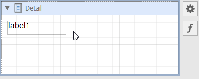

### Slide XRControl to the End of the Area with a Minimum Indent

| Key | Action |
|---|---|
| <kbd>Up Arrow</kbd> | Slide XRControl up. |
| <kbd>Down Arrow</kbd> | Slide XRControl down. |
| <kbd>Left Arrow</kbd> | Slide XRControl left. |
| <kbd>Right Arrow</kbd> | Slide XRControl right. |

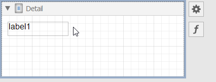

### Shift XRControl Pixel by Pixel

| Key | Action |
|---|---|
| <kbd>Ctrl</kbd> + <kbd>Up Arrow</kbd> | Shift XRControl one pixel upward. |
| <kbd>Ctrl</kbd> + <kbd>Down Arrow</kbd> | Shift XRControl one pixel down. |
| <kbd>Ctrl</kbd> + <kbd>Left Arrow</kbd> | Shift XRControl one pixel to the left. |
| <kbd>Ctrl</kbd> + <kbd>Right Arrow</kbd> | Shift XRControl one pixel to the right. |

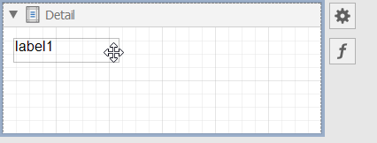

### Resize XRControl to the Widest/Highest Possible Value

| Key | Action |
|---|---|
| <kbd>Shift</kbd> + <kbd>Up Arrow</kbd> | Move the XRControl's bottom border to the lowest possible value. |
| <kbd>Shift</kbd> + <kbd>Down Arrow</kbd> | Move the XRControl's bottom border to the highest possible value. |
| <kbd>Shift</kbd> + <kbd>Right Arrow</kbd> | Move the XRControl's right border to the widest possible value. |
| <kbd>Shift</kbd> + <kbd>Left Arrow</kbd> | Move the XRControl's right border to the narrowest possible value. |

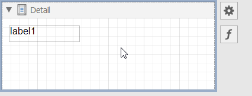

### Resize XRControl Pixel by Pixel

| Key | Action |
|---|---|
| <kbd>Ctrl</kbd> + <kbd>Shift</kbd> + <kbd>Up Arrow</kbd> | Move the XRControl's bottom border upward by one pixel. |
| <kbd>Ctrl</kbd> + <kbd>Shift</kbd> + <kbd>Down Arrow</kbd> | Move the XRControl's bottom border downward by one pixel. |
| <kbd>Ctrl</kbd> + <kbd>Shift</kbd> + <kbd>Left Arrow</kbd> | Move the XRControl's right border to the left by one pixel. |
| <kbd>Ctrl</kbd> + <kbd>Shift</kbd> + <kbd>Right Arrow</kbd> | Move the XRControl's right border to the right by one pixel. |

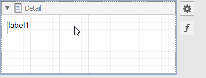

### Resize XRControl Proportionally

| Key | Action |
|---|---|
| <kbd>Shift</kbd> + <kbd>Drag</kbd> | Resize an XRControl and preserve its aspect ratio. Initiate the operation in a corner anchor. |

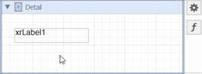

### Clone XRControl

| Key | Action |
|---|---|
| <kbd>Ctrl</kbd> + <kbd>Drag</kbd> | Clone XRControl. |

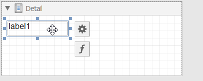

### Select Multiple XRControls

| Key | Action |
|---|---|
| <kbd>Ctrl</kbd> + <kbd>Click</kbd> or <kbd>Shift</kbd> + <kbd>Click</kbd> | Select/unselect multiple XRControls. |

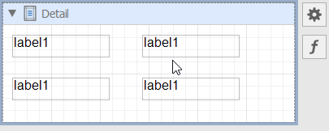

### Rotate XRShape

| Key | Action |
|---|---|
| <kbd>Ctrl</kbd> + <kbd>Drag</kbd> | Rotate XRShape. |

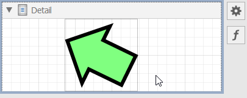

## Operations with the Field List

| Key | Action |
|---|---|
| <kbd>Drag</kbd> a table | Add XRTable with bindings to all data fields. |

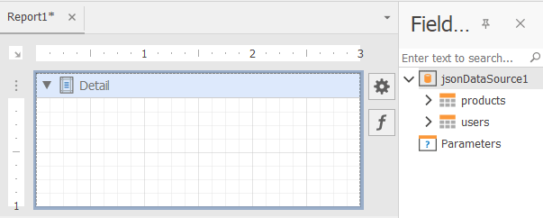

| Key | Action |
|---|---|
| <kbd>Shift</kbd> + <kbd>Drag</kbd> a table | Add XRTable with all data field names. |

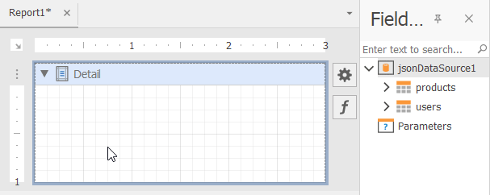

## Operations with the End-User Report Designer

| Key | Action |
|---|---|
| <kbd>F4</kbd> | Switch to the Designer tab. |
| <kbd>F5</kbd> | Switch to the Preview tab. |

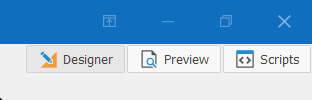

| Key | Action |
|---|---|
| <kbd>Ctrl</kbd> + <kbd>L</kbd> | Save all opened report layouts. |
| <kbd>Ctrl</kbd> + <kbd>S</kbd> | Save the selected report layout. |
| <kbd>Ctrl</kbd> + <kbd>O</kbd> | Open a `.repx` report. |
| <kbd>Ctrl</kbd> + <kbd>N</kbd> | Create a new report. |
| <kbd>Ctrl</kbd> + <kbd>W</kbd> | Create a new report with the Wizard. |
| <kbd>Ctrl</kbd> + <kbd>Scroll Down</kbd> | Zoom in the selected report. |
| <kbd>Ctrl</kbd> + <kbd>Scroll Up</kbd> | Zoom out the selected report. |
| <kbd>Ctrl</kbd> + <kbd>0</kbd> | Set zoom to 100%. |
