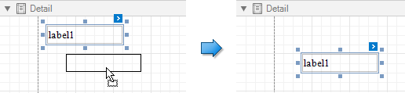
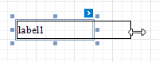

# Move and Resize Report Elements

You can use the mouse or keyboard to move a report control to a new location.

You can [select multiple controls](select-report-elements-and-access-their-settings.md) and move them in the same way as individual report controls.

You can also use the [Report Explorer](../../report-designer-tools/ui-panels/report-explorer.md) to move a control. You can move controls to other bands (except the **DetailReport** band), or into a **Panel** or **TableCell** controls. Select a control and drag it (either within the Report Explorer or to the design surface). The drop targets are highlighted when you drag the control over them.

> [!NOTE]
> You can drag the TableOfContents control only to the **ReportHeader** and **ReportFooter** bands.

To resize a control, select it and then drag a rectangle drawn on its edge or corner. Press `Shift` and drag a corner anchor to resize a report control and preserve its aspect ratio.

s
Drag a band's header strip to resize the band.

You can also press SHIFT+ARROW or CTRL+SHIFT+ARROW to resize a selected element.

See [Arrange Report Controls](arrange-report-controls.md) for information about tools that help you align report controls to each other and layout edges.
