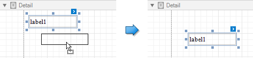
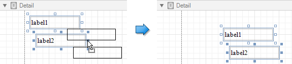
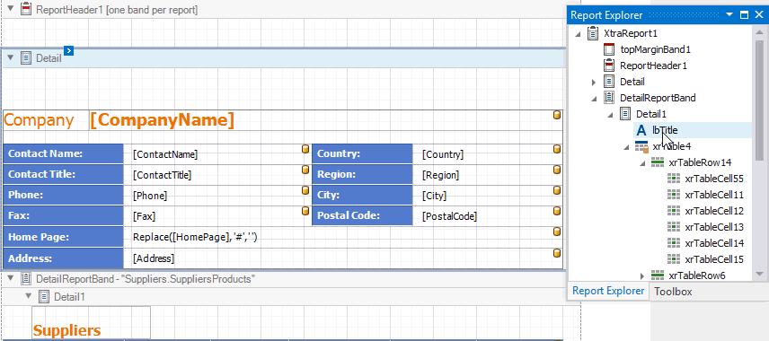
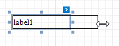
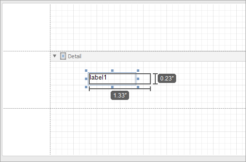
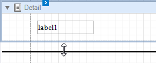

# Move and Resize Report Elements

## Move Report Elements

You can use the mouse or keyboard to move a report control to a new location.

You can [select multiple controls](select-report-elements-and-access-their-settings.md) and move them in the same way as individual report controls.

You can also use the [Report Explorer](../../report-designer-tools/ui-panels/report-explorer.md) to move a control to other bands (except the **Detail Report Band**), or into a **Panel** or **Table Cell** control. Select a control and drag it within the Report Explorer. The drop targets are highlighted when you drag the control over them.

You can also use the Report Explorer to move table cells inside of a table.

> You can drag the **Table Of Contents** only to the **Report Header Band** and **Report Footer Band**.

## Resize Report Elements

Select a control and then drag a rectangle drawn on its edge or corner to resize it. Press <kbd>Shift</kbd> and drag a corner anchor to resize a control and preserve its aspect ratio.

Dimensions notations appear when you resize a control. They indicate the control's width and height in report units: 

Drag a band's header strip to resize the band.

You can also press <kbd>Shift</kbd>+<kbd>Arrow</kbd> or <kbd>Ctrl</kbd>+<kbd>Shift</kbd>+<kbd>Arrow</kbd> to resize a selected element.

See [Arrange Report Controls](arrange-report-controls.md) for information about tools that help you align report controls to each other and layout edges.
