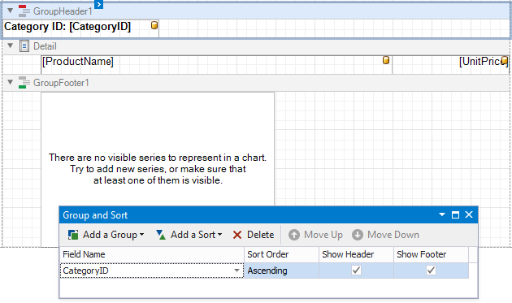
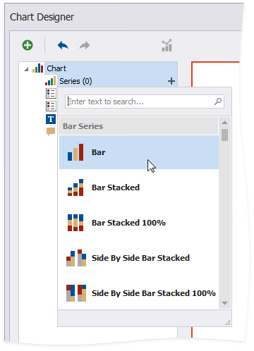
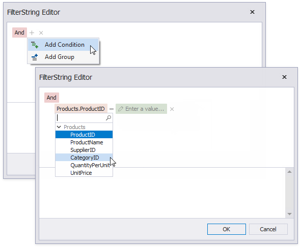
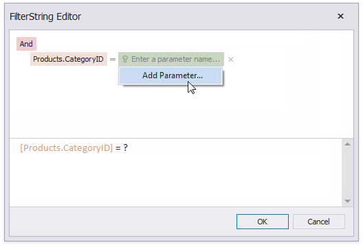

---
title: Use Charts to Visualize Grouped Data
author: Anna Gubareva
---
# Use Charts to Visualize Grouped Data

This topic describes how to use charts to visualize grouped data in a report.

In this tutorial, the report data is grouped against a data field (the report's group field). A chart is placed in the Group Footer band and is not bound to data. The report's data source is used to populate the chart with data.

Follow the steps below to make each chart instance display data for its group.

1. Select the chart. Open the [Toolbar](../../report-designer-tools/toolbar.md)'s **Chart Tools** contextual tab and click **Run Designer**.

	

1. Add a new series. Click the plus button next to the **Series** item in the Chart Designer.

	

	Select a series type.

	

1. Provide data for the argument and value axes.

	Switch to the created series' **Data** tab. Drop fields onto the **Argument** and **Value** areas.
	
	

1. Filter the chart. Go to the **Properties** tab. Click the **Filter String** property's ellipsis button to invoke the FilterString Editor.
	
	

	Add a filter condition. On the left side, specify the field by which chart data should be filtered.

	

	On the right side, use a chart parameter to obtain a group value from the report's group field. Click the right side's icon until it turns into a question mark and select **Add Parameter** from the context menu to invoke the Add New Parameter dialog.

	

	Set the **Binding** property to the report's group field and click **OK**.

	

Click OK in the FilterString Editor and in the Chart Designer to apply changes.

Switch to [Print Preview](../../preview-print-and-export-reports.md) to see the result.

